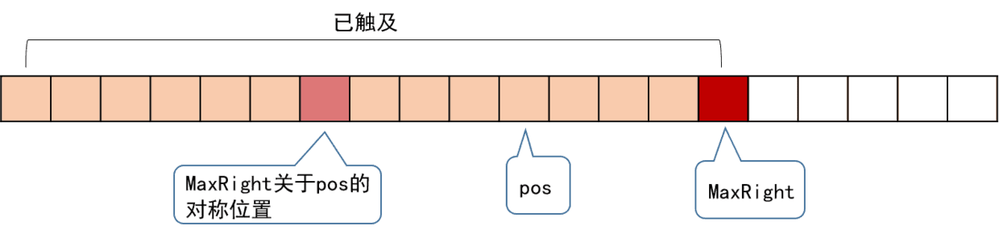
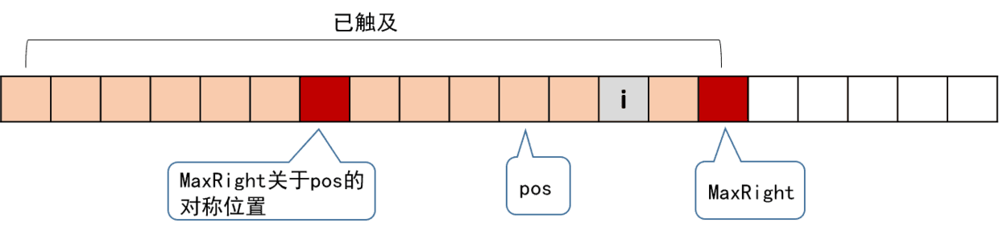
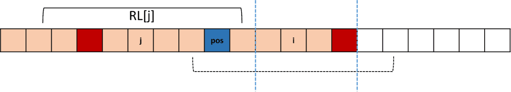

## 10.15 回文类问题探讨

### 回文问题
回文类的基本方法是首尾两指针同时前进判断是否相等。一般回文类问题可以分为以下四类：

#### 回文拼装验证
给定一个string或者char array，可以把每一个char单独拆出来进行拼装，问你用这里面的char（不一定全用，根据题目条件而定）能不能组成palindrome或者能够组成的最长的palindrome的长度。
* 如果是必须全用，那么判断条件就是至多有不超过一个char's freq是odd。
* 如果可以不全用，那么就变成取所有的偶数freq的char和奇数freq - 1的char，再加最多一个odd的char，这种问题就是HashMap统计frequency的典型应用，一般时间复杂度就是O(n)。

我们看一道类似题目：
Given a string which consists of lowercase or uppercase letters, find the length of the longest palindromes that can be built with those letters. This is case sensitive, for example "Aa" is not considered a palindrome here.

该题比较简单，这里就不再详述，具体代码如下所示：
```Java
public int longestPalindrome(String txt) {
    Map<Character, Integer> char2Count = new HashMap<>();
    //统计每个字符的次数
    for (int i = 0; i < txt.length(); i++) {
        char c = txt.charAt(i);
        int count = char2Count.getOrDefault(c, 0);
        char2Count.put(c, ++count);
    }

    int len = 0;
    boolean mid = false;
    for (Integer count : char2Count.values()) {
        len += count;
        if (count % 2 != 0) {
            len--;
            mid = true;
        }
    }

    return mid ? len + 1 : len;
}
```

#### 回文排列或者组合
给定一个string或者char array，求所有可以组成的palindrome。这里又分为两类：
* 第一种是permutation问题，这里组成的palindrome顺序matters而且要返回所有结果。不过要确保我们可以组成palindrome，第一类问题的验证往往也会被用到。之后问题就变成了在可选的chars里面做dfs permutation with duplicates。还有一点需要注意的是是中间有没有落单的那个char，如果有就要加进去。这种题目的时间复杂度一般是指数级别。
* 第二种是combination问题，也就是给定string，求所有的palindrome划分，比如palindrome partitioning。

##### Palindrome Permutation II
给出一个字符串，返回它的所有回文排列，比如没有则返回空。比如给出字符串“aabb”，返回“abba”和“baab”。

该题给了我们一个提示：如果回文全排列存在，我们只需要生成前半段字符串即可，后面的直接根据前半段得到。但是对于是奇数的情况，我们需要额外记录中间字符。前面我们说过：如果一个字符串的回文排列存在，那么奇数个的字符只能有0个或1个，其余的必须是偶数个。所以我们可以使用一个map统计所有字符的个数，然后遍历该map，我们将所有字符个数除以2加入到sb中，然后求其全排列，每得到一个排列，则加上mid字符和该排列的逆序串则就是所求的一种回文串。具体代码如下所示：
```Java
public List<String> genPalindromes(String s) {
    List<String> result = new ArrayList<>();
    Map<Character, Integer> char2Count = new HashMap<>();
    //频率统计
    for (int i = 0; i < s.length(); i++) {
        char c = s.charAt(i);
        int count = char2Count.getOrDefault(c, 0);
        char2Count.put(c, ++count);
    }
    
    //得到left和mid
    StringBuilder left = new StringBuilder();
    StringBuilder mid = new StringBuilder();
    for (Map.Entry<Character, Integer> entry : char2Count.entrySet()) {
        char c = entry.getKey();
        int count = entry.getValue();
        if (count % 2 == 1) {
            mid.append(c);
        }

        for (int i = 0; i < count / 2; i++) {
            left.append(c);
        }
        if (mid.length() > 1) {
            return result;
        }
    }

    char[] chars = left.toString().toCharArray();
    Arrays.sort(chars);
    boolean[] visited = new boolean[chars.length];
    Arrays.fill(visited, false);
    List<Character> path = new ArrayList<>();
    permute(chars, visited, path, mid.toString(), result);
    return result;
}

private void permute(char[] chars, boolean[] visited, List<Character> path, String mid, List<String> result) {
    if (path.size() == chars.length) {
        String left = StringUtils.join(path.toArray());
        result.add(left + mid + StringUtils.reverse(left));
        return;
    }

    for (int i = 0; i < chars.length; i++) {
        if (visited[i] || (i != 0 && chars[i] == chars[i - 1] && !visited[i - 1])) {
            continue;
        }

        visited[i] = true;
        path.add(chars[i]);
        permute(chars, visited, path, mid, result);
        path.remove(path.size() - 1);
        visited[i] = false;
    }
}
```

#### 回文子串
求满足条件的substring palindrome，比如找最长的substring palindrome，这种问题的核心是substring，可以通过动态规划或者后缀数组来完成，或者考虑使用manacher算法，能达到O(n)的时间复杂度，非常精妙。

##### Longest Palindromic Substring
该题一般可以考虑使用中心扩散法：显然回文串是对称的，长度为奇数的回文串以中间字符为中心对称，而长度为偶数的回文串的对称轴在中间两个字符之间的空隙。所有我们可以遍历这些位置，在每个位置上同时向左和向右扩展，直到左右两边的字符不同，或者达到边界。对于一个长度为n的字符串，这样的位置一共有n+n-1=2n-1个，在每个位置上平均大约要进行n/4次字符比较，于是此算法的时间复杂度是O(n^2)。

但是我们这里要详细介绍的是Manacher算法，其能达到O(n)的时间复杂度。首先我们看一下中心扩散法的缺点：
* 由于回文串长度的奇偶性造成了不同性质的对称轴位置；
* 很多子串被重复多次访问比较，造成较差的时间效率。

第二个缺点不容易理解，我们这个举个例子说明一下：
```
char: a b a b a
  i : 0 1 2 3 4
```
当i=1时回文为aba，其长度是3（此时我们比较过位置0和位置2）；i=2时回文为ababa，其长度是5（此时我们分别比较了位置0和位置4，位置1和位置3）；到i=3时，此时又要重复比较位置2和位置4，而实际上如果位置0和位置2相等，而位置0和位置4又是相等的，则位置2和位置4肯定相等，这个比较是不必要的。

我们看一下manacher算法是如何改进这两个缺点的：
* 解决长度奇偶性带来的对称轴位置问题，Manacher算法首先对字符串做一个预处理，在所有的空隙位置(包括首尾)插入同样的符号，要求这个符号是不会在原串中出现的，这样会使得所有的串都是奇数长度的。以插入#号为例：`abba ———>  #a#b#b#a#`。插入的是同样的符号，且符号不存在于原串，因此子串的回文性不受影响，原来是回文的串，插完之后还是回文的，原来不是回文的，依然不会是回文。
* 解决重复访问比较的问题，我们把一个回文串中最左或最右位置的字符与其对称轴的距离称为回文半径。Manacher定义了一个回文半径数组RL，RL[i]表示以第i个字符为中心的回文串的回文半径，即以第i个字符为中心的回文串的最左或者最右一个字符与字符i的距离。对于上面插入分隔符之后的两个串，可以得到RL数组：
```
char:    # a # b # b # a #
 RL :    1 2 1 2 5 2 1 2 1
RL-1:    0 1 0 1 4 1 0 1 0
  i :    0 1 2 3 4 5 6 7 8
  ```
上面我们还求了一下RL[i]-1，可以发现，RL[i]-1的值，正是在原本那个没有插入过分隔符的串中，以位置i为中心的最长回文串的长度。那么只要我们求出了RL数组，就能得到最长回文子串的长度。于是问题变成了，怎样高效地求的RL数组。基本思路是利用回文串的对称性，扩展回文串。

我们再引入两个辅助变量MaxRight和pos，前者表示当前已访问过的所有回文子串，最右一个字符的位置，后者表示maxRight对应的回文串的中心所在位置。如下图所示：



我们从左往右地访问字符串来求解RL，假设当前访问到的位置为i，即要求RL[i]，这里我们要分为两种情况考虑：i是在MaxRight的左边还是右边。

我们首先看一下i在MaxRight的右边时，遇到这种情况，说明以i为中心的回文串还没有被访问过，于是只能从i的左右两边开始尝试扩展了，当左右两边字符不同，或者到达字符串边界时停止。然后更新MaxRight和pos。

当i在MaxRight的左边，如下图所示：



我们知道，图中以pos为中心的两个红色块之间（包括红色块）的子串是回文的，而以i为中心的回文串，是pos为中心的回文串是有所重叠的。我们找到i关于pos的对称位置j，这个j对应的RL[j]我们是已经算过的。根据回文串的对称性，以i为对称轴的回文串和以j为对称轴的回文串，有一部分是相同的。这里又有两种细分的情况。

以j为中心的回文串比较短，如下图所示：


此时则RL[i]至少不小于RL[j]，于是可以令RL[i]=RL[j]，然后以i为中心，继续往左右两边扩展，直到左右两边字符不同，或者到达边界从而计算出RL[i]。

以j为对称轴的回文串很长，如下图所示：



这时，我们只能确定，两条蓝线之间的部分（即不超过MaxRight的部分）是回文的，于是从这个长度开始，尝试以i为中心向左右两边扩展，直到左右两边字符不同，或者到达边界。

然后都要更新MaxRight和pos，继续求解下一个RL。具体代码如下所示：
```Java
public int manacher(String txt) {
    //预处理txt，插入#
    StringBuilder sb = new StringBuilder();
    sb.append('#');
    for (int i = 0; i < txt.length(); i++) {
        sb.append(txt.charAt(i));
        sb.append('#');
    }
    String s = sb.toString();         

    int len = s.length();
    int[] rl = new int[len];
    int pos = 0;
    int maxRight = 0;
    int maxLen = 0;
    for (int i = 0; i < len; i++) {
        if (i < maxRight) {
            //i和j关于pos对称，则i + j = 2 * pos
            rl[i] = Math.min(rl[2 * pos - i], maxRight - i);
        } else {
            rl[i] = 1;
        }

        //左右扩展rl[i]
        while (i - rl[i] >= 0 && i + rl[i] < len && s.charAt(i - rl[i]) == s.charAt(i + rl[i])) {
            rl[i]++;
        }

        //更新maxRight和pos
        if (i + rl[i] - 1 > maxRight) {
            maxRight = i + rl[i] - 1;
            pos = i;
        }

        maxLen = Math.max(maxLen, rl[i]);
    }
    return maxLen - 1;
}
```

##### Palindrome Pairs
简单思考一下，我们知道构成回文对有两种情况：“abc”和“cba”这种互为reverse的对；“abc”和“ba”这种补充型的对（“cb”和“abc”也可以）。

接下来我们简单描述一下该算法：
首先使用一个map来建立每个单词和其位置的映射以及一个TreeSet来保存单词的长度。然后遍历单词集，对于遍历到的单词，我们将其反转一下，然后依次处理两种情况：
* 第一种则是直接在哈希表查找翻转后的字符串是否存在，注意不能和原字符串的坐标位置相同
* 针对第二种情况比较复杂一些，我们先举一个简单例子说明一下，查找到“abc”时，其reverse为“cba”，则查找所有小于当前长度的单词，比如存在len=2的单词，我们后补充为例，则首先判断“cba”的前子串“c”是否回文，如果回文在判断map中是否存在单词“ba”，前补充处理方法类似。
```Java
public List<List<Integer>> palindromePairs(List<String> words) {
    List<List<Integer>> result = new ArrayList<>();
    Map<String, Integer> word2Index = new HashMap<>();
    TreeSet<Integer> lens = new TreeSet<>();

    for (int i = 0; i < words.size(); i++) {
        word2Index.put(words.get(i), i);
        lens.add(words.get(i).length());
    }

    for (int i = 0; i < words.size(); i++) {
        String word = words.get(i);
        String r = StringUtils.reverse(word);

        //是否存在互为reverse的单词对
        if (word2Index.containsKey(r) && word2Index.get(r) != i) {
            result.add(Arrays.asList(i, word2Index.get(r)));
        }

        int len = word.length();
        Set<Integer> set = lens.headSet(len);
        for (Integer l : set) {
            //前补充
            String ls = r.substring(0, l);
            if (isPalindrome(r, l, len - 1) && word2Index.containsKey(ls)) {
                result.add(Arrays.asList(word2Index.get(ls), i));
            }

            //后补充
            String rs = r.substring(len - l);
            if (isPalindrome(r, 0, len - l - 1) && word2Index.containsKey(rs)) {
                result.add(Arrays.asList(i, word2Index.get(rs)));
            }
        }
    }
    return result;
}

private boolean isPalindrome(String word, int left, int right) {
    while (left < right) {
        if (word.charAt(left++) != word.charAt(right--)) {
            return false;
        }
    }
    return true;
}
```

##### Shortest Palindrome
给定一个字符串s，你可以通过在字符串前面添加字符将其转换为回文串，找到并返回可以用这种方式转换的最短回文串。例如对于字符串"babcd"，输出为"dcbabcd"。

简单分析该问题可知：找到原字符串中以第一个字符为起点的最长回文子串，然后把剩余部分的翻转补充到原字符串前面即可。该问题我们可以用kmp的思想来解决：
* 首先求字符串s的翻转sr，并将这两个字符串进行拼接：s#sr
* 找出新字符串中最长公共前缀后缀长度lcps，则`sr.substring(0, s.length() - lcps)`就是需要在原字符串头部插入的子串部分

我们举个例子说明一下：对于字符串s：babcd，先求sr：dcbab，拼接之后：babcd#dcbab。显然拼接之后，求解原串以首字符开始的最长回文子串就变成了求这个拼接字符串的最大公共前缀后缀了，也就是kmp的思想，具体代码如下所示：
```Java
public String shortestPalindrome(String s) {
    String sr = StringUtils.reverse(s);
    String t = s + "#" + sr;
    int[] next = getNext(t);
    return sr.substring(0, s.length() - next[next.length - 1]) + s;
}
```

#### 其他回文问题
最后就是验证一个给定的input是不是palindrome，我们这里讨论一下以下三类：
* List：list只能单向遍历，所以我们只能取中点，然后reverse后半段，最后比较相同。在List一节我们详细讨论过该问题，这里就不再详述了。
* Integer：因为是signed number，所以我们可以直接做乘除的运算。
* Bits：因为是unsigned number，所以我们不能直接进行乘除的运算，而是要使用位移操作。

我们看一个integer的回文判断问题，这里我们注意一下如何分别获取最高位和最低位。
```Java
public boolean isPalindrome(int num) {
    if (num < 0) {
        return false;
    }

    int div = 1;
    while (num / div >= 10) {
        div *= 10;
    }
    while (num > 0) {
        int left = num / div;
        int right = num % 10;
        if (left != right) {
            return false;
        }
        num = (num % div) / 10;
        div /= 100;
    }
    return true;
}
```

接下来我们再看一个bits回文的问题，具体代码如下所示：
```Java
public boolean isPalindromeBits(int num) {
    int left = 0;
    int right = 31;
    while (left < right) {
        if (isKthBitSet(num, left) != isKthBitSet(num, right)) {
            return false;
        }
        left++;
        right--;
    }
    return true;
}

public boolean isKthBitSet(int num, int k) {
    return (num & (1 << k)) == 1;
}
```

### reverse问题
其实，reverse的操作和判断palindrome的操作几乎一样（回文判断问题一般都可以通过reverse来解决），都是首尾两指针同时前进，基本模板代码如下所示：
```Java
public void reverse(char[] array) {
    int start = 0;
    int end = array.length - 1;
    while (start < end) {
        swap(array, start, end);
        start++;
        end--;
    }
}
```
和palindrome问题一样，有时候我们在reverse的时候有条件限制，不是所有的char都需要操作，即有些char需要跳过，那么就需要我们在while loop的内部再使用while loop进行忽略。具体代码如下所示：
```Java
public void reverse(char[] array) {
    int start = 0;
    int end = array.length - 1;
    while (start < end) {
        while (start < end && char[start]不满足条件) {
            start++;
        }
        while (start < end && char[end]不满足条件) {
            end--;
        }
        if (start < end) {
            swap(array, start, end);
        }

        start++;
        end--;
    }
}
```

#### reverse string/array
String/Array的题目的共性是我们可以从首尾两端同时前进，这类问题一般有两种解决办法：
* 使用reverse的算法（有时要全局和局部各使用一次）。
* 使用stack辅助操作（其实reverse本身就用到了栈的思想）。

##### Reverse Words in a String II
翻转字符串中的单词，比如给出字符串"hello world"，输出"world hello"，这道题有多种解法：
* 可以先翻转整个字符串，再翻转每一个单词（两个空格之间则为一个单词）
* 也可以将整个字符串split为一个list，然后翻转整个list即可，具体代码如下所示：
```Java
public String reverseWords(String txt) {
    String[] words = txt.trim().split(" +");
    Collections.reverse(Arrays.asList(words));
    return String.join(" ", words);
}
```

##### Reverse Vowels of a String
翻转单词中元音字母，典型的第二个模板，当不是元音字母时则跳过，具体代码如下所示：
```Java
public String reverseVowels(String txt) {
    char[] chars = txt.toCharArray();
    int left = 0;
    int right = chars.length - 1;
    while (left < right) {
        while (left < right && !isVowel(chars[left])) {
            left++;
        }
        while (left < right && !isVowel(chars[right])) {
            right--;
        }
        if (left < right) {
            swap(chars, left, right);
        }
    }
    return new String(chars);
}
```

#### reverse Integer
这类问题和reverse bit最大的区别是reverse integer是把integer作为signed number来对待的。也就是说java表示的就是我们想要的，所以我们可以直接通过乘除运算来做进制转换。
```Java
public int reverse(int num) {
    int result = 0;
    while (num != 0) {
        if (Math.abs(result) > Integer.MAX_VALUE / 10) {
            return 0;
        }
        result *= 10;
        result += num % 10;
        num /= 10;
    }
    return result;
}
```

#### reverse bits
reverse bits和reverse int的区别是reverse bits里面我们是把integer作为unsigned number来对待的。也就是说java实际表示的不是我们想要的数，所以我们就不能直接进行乘除运算了，而要使用位移操作。
```Java
public int reverseBits(int num) {
    int result = 0;
    for (int i = 0; i < 32; i++) {
        result <<= 1;
        if ((num & 1) == 1) {
            result++;
        }
        num >>= 1;
    }
    return result;
}
```

#### reverse List
因为是单向链表，我们只能one direction traverse，这是reverse List和String/Array最本质的区别。对于List的reverse问题，我们在List一节详细讨论过，这里就不再详述。

### rotate问题

#### rotate String/Array类
String/Array的题目的共性还是我们可以从首尾两端同时前进，这类问题也有两种解法：
* 第一是使用“三步反转法”。
* 第二是使用queue（其实Rotate本身就用到了queue的思想）。

#### rotate list
rotate list不需要使用三步反转法，因为list本身就是一个queue，只需要将后面一段接到前面即可。
