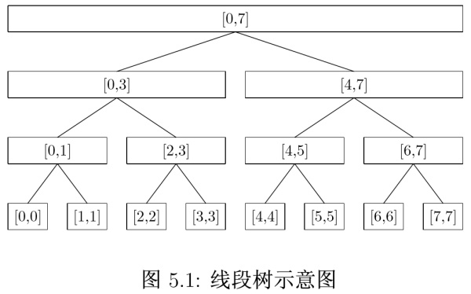

## 10.20 线段树

### 10.20.1 线段树简介
我们经常会遇到一些需要在区间上进行查询，修改的需求。为了支持这些操作，引入了一种名为线段树的数据结构。线段树有以下特点：
* 线段树是一棵高度平衡的二叉树，有可能是满二叉树或者完全二叉树，但这不是必要条件。
* 线段树的每个结点代表一个区间，父结点所代表的区间是两个子结点的和，兄弟结点所代表的区间相互不重叠，根结点代表整个区间。
如下图所示，根结点代表区间 `[0,7]`，而其左子结点，则代表区间`[0,3]`，右子结点代表区间`[4,7]`。这是一种把父结点所代表的区间直接二分的实现方法（实际上两个子结点的区间长度实际上是可以随意变化的），二分实现的好处是树是高度平衡的，树的高度为 log(n)。



下面以 sum 为例给出一个 SegmentTree 的实现，具体代码如下所示：
```Java
public class SegmentTree {
    static class StNode {
        int start;
        int end;
        int sum;
        StNode left;
        StNode right;

        public StNode(int start, int end, int sum) {
            this.start = start;
            this.end = end;
            this.sum = sum;
        }
    }

    StNode root;

    public SegmentTree(int[] nums) {
        root = buildTree(nums, 0, nums.length - 1);
    }

    private StNode buildTree(int[] nums, int start, int end) {
        if (nums == null || nums.length == 0) {
            return null;
        }
        if (start == end) {
            return new StNode(start, end, nums[start]);
        }

        int mid = start + (end - start) / 2;
        StNode left = buildTree(nums, start, mid);
        StNode right = buildTree(nums, mid + 1, end);
        StNode root = new StNode(start, end, left.sum + right.sum);
        root.left = left;
        root.right = right;
        return root;
    }

    public void update(int i, int value) {
        update(root, i, value);
    }

    private void update(StNode node, int i, int value) {
        if (node == null) {
            return;
        }
        if (i < node.start || i > node.end) {
            return;
        }

        if (node.start == i && node.end == i) {
            node.sum = value;
            return;
        }

        update(node.left, i, value);
        update(node.right, i, value);
        node.sum = node.left.sum + node.right.sum;
    }

    public int query(int i, int j) {
        if (i < j) {
            throw new IllegalArgumentException("i must larger than j");
        }
        return query(root, i, j);
    }

    private int query(StNode node, int i, int j) {
        if (node == null) {
            return 0;
        }
        if (i > node.end || j < node.start) {
            return 0;
        }

        i = Math.max(i, node.start);
        j = Math.min(j, node.end);
        if (node.start == i && node.end == j) {
            return node.sum;
        }
        int left = query(node.left, i, j);
        int right = query(node.right, i, j);
        return left + right;
    }
}
```

### 10.20.2 线段树应用

#### [Range Sum Query Mutable](https://leetcode.com/problems/range-sum-query-mutable/)
该题非常适合使用线段树求解，一边 update，一边求解 range sum，当然该题还有一种更好的解法是使用 Binary Indexed Tree。

```Java
public class RangeSumQuery {
    SegmentTree segmentTree;

    public RangeSumQuery(int[] nums) {
        segmentTree = new SegmentTree(nums);
    }

    public void update(int i, int value) {
        segmentTree.update(i, value);
    }

    public int sumRange(int i, int j) {
        return segmentTree.query(i, j);
    }
}
```