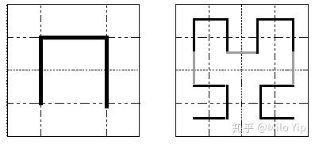

## 10.21 面经

#### Collatz Conjecture
Given an integer number, If it is odd, the next transform is 3*n+1; If it is even, the next transform is n/2. The number is finally transformed into 1. Find out how many steps of transform needed for a number turned into 1.

Given an integer n, output the max steps of transform number in [1, n] into 1.

将数字最终转换为1，我们这里使用一个map记录中间变量和步骤以加快搜索过程。具体代码如下所示：
```Java
public class CollatzConjecture {
    private Map<Integer, Integer> num2Step = new HashMap<>();

    public int findLongestSteps(int num) {
        if (num < 1) {
            return 0;
        }

        int result = 0;
        for (int i = 1; i <= num; i++) {
            int step = findStep(i);
            num2Step.put(i, step);
            result = Math.max(result, step);
        }
        return result;
    }

    private int findStep(int num) {
        if (num <= 1) {
            return 1;
        }

        if (num2Step.containsKey(num)) {
            return num2Step.get(num);
        }

        if (num % 2 == 0) {
            num = num / 2;
        } else {
            num = 3 * num + 1;
        }

        int step = findStep(num);
        num2Step.put(num, step);
        return step + 1;
    }
}
```

#### Implement Queue with Limited Size of Array
Implement a queue with a number of arrays, in which each array has fixed size.

使用固定长度的array创建一个不固定长度的queue，则我们可以将array拼接起来：即每个array的最后一个元素指向为下一个array的引用。具体代码如下所示：
```Java
public class QueueOnFixedArray {
    private int capacity;
    private int size;
    //使用head和headList标记从Queue前端获取元素的位置
    private int head;
    private List<Object> headList;
    //使用tail和tailList标记从Queue后端添加元素的位置
    private int tail;
    private List<Object> tailList;

    public QueueOnFixedArray(int capacity) {
        this.capacity = capacity;
        this.size = 0;
        this.head = 0;
        this.tail = 0;
        this.headList = new ArrayList<>(capacity);
        this.tailList = headList;
    }

    public void offer(int num) {
        if (tail < capacity - 1) {
            tailList.add(num);
        } else {
            //说明添加到list末尾了，需要再创建一个list并且拼接在tailList之后，然后将tailList重置newList
            List<Object> newList = new ArrayList<>(capacity);
            newList.add(num);
            tailList.add(newList);
            tailList = newList;
            tail = 0;
        }
        size++;
        tail++;
    }

    public Integer poll() {
        if (size == 0) {
            return null;
        }

        int num = (int) headList.get(head);
        head++;
        size--;
        if (head == capacity - 1) {
            //说明取到了headList的末尾了，则获取下一个list，然后将headList重置为这个newList
            List<Object> newList = (List<Object>) headList.get(head);
            headList.clear();
            headList = newList;
            head = 0;
        }
        return num;
    }

    public int size() {
        return this.size;
    }
}
```

#### List of List Iterator
Given an array of arrays, implement an iterator class to allow the client to traverse and remove elements in the array list. This iterator should provide three public class member functions:
* boolean hasNext() return true if there is another element in the set
* int next() return the value of the next element in the array
* void remove() remove the last element returned by the iterator. That is, remove the element that the previous next() returned. This method can be called only once per call to next(), otherwise an exception will be thrown.

这里我们给出了两个实现，一个使用Iterator实现，一个使用index实现。具体如下所示：
```Java
public static class Vector2D1 {
    private List<List<Integer>> nums;

    public Vector2D1(List<List<Integer>> nums) {
        this.nums = nums;
    }

    public Iter iterator() {
        return new Iter(nums.iterator(), Collections.emptyIterator());
    }

    class Iter {
        private Iterator<List<Integer>> row;
        private Iterator<Integer> col;

        public Iter(Iterator<List<Integer>> row, Iterator<Integer> col) {
            this.row = row;
            this.col = col;
        }

        public boolean hasNext() {
            while ((col == null || !col.hasNext()) && row.hasNext()) {
                col = row.next().iterator();
            }
            return col != null && col.hasNext();
        }

        public Integer next() {
            return col.next();
        }

        public void remove() {
            while (col == null && row.hasNext()) {
                col = row.next().iterator();
            }
            if (col != null) {
                col.remove();
            }
        }
    }
}
```
需要注意的是remove的实现，remove要求删除上一个next的元素。这里首先定位到需要删除的list，然后删除该list中对应的元素，如果删除后该list为空，则从外围list中删除该list。具体代码如下所示：
```Java
public static class Vector2D2 {
    private List<List<Integer>> nums;

    public Vector2D2(List<List<Integer>> nums) {
        this.nums = nums;
    }

    public Iter iterator() {
        return new Iter(0, 0);
    }

    class Iter {
        private int row;
        private int col;

        public Iter(int row, int col) {
            this.row = row;
            this.col = col;
        }

        public boolean hasNext() {
            if (nums == null || nums.isEmpty()) {
                return false;
            }

            while (row < nums.size()) {
                if (col < nums.get(row).size()) {
                    return true;
                } else {
                    row++;
                    col = 0;
                }
            }
            return false;
        }

        public Integer next() {
            return nums.get(row).get(col++);
        }

        public void remove() {
            List<Integer> listTBR;
            int rowTBR = row;
            int colTBR = col;
            if (col == 0) {
                rowTBR--;
                listTBR = nums.get(rowTBR);
                colTBR = nums.get(rowTBR).size() - 1;
            } else {
                colTBR--;
                listTBR = nums.get(rowTBR);
            }
            listTBR.remove(colTBR);
            if (listTBR.isEmpty()) {
                nums.remove(listTBR);
                row--;
            }
            if (col > 0) {
                col--;
            }
        }
    }
}
```

#### Display Page (Pagination)
Given an array of CSV strings representing search results, output results sorted by a score initially. A given host may have several listings that show up in these results. Suppose we want to show 12 results per page, but we don’t want the same host to dominate the results.

Write a function that will reorder the list so that a host shows up at most once on a page if possible, but otherwise preserves the ordering. Your program should return the new array and print out the results in blocks representing the pages.

Given an array of csv strings, output results separated by a blank line.

这里我们使用Iterator，具体代码如下所示：
```Java
public class DisplayPage {
    public List<String> displayPages(List<String> pages, int size) {
        List<String> result = new ArrayList<>();
        Iterator<String> iterator = pages.iterator();
        //这里使用Set用于当前分页判重
        Set<String> ids = new HashSet<>();
        //使用一个end标识是否到了结尾，不需要再按照唯一性分组
        boolean end = false;
        int count = 0;
        while (iterator.hasNext()) {
            String cur = iterator.next();
            String id = (cur.split(","))[0];

            if (!ids.contains(id) || end) {
                result.add(cur);
                ids.add(id);
                iterator.remove();
                count++;
            }

            //找到一个分页结果则清理ids，并重置iterator
            if (count == size) {
                if (!pages.isEmpty()) {
                    result.add(" ");
                }
                count = 0;
                ids.clear();
                iterator = pages.iterator();
            }

            //如果pages中没有元素，说明到底末尾了，则重置iterator
            if (!iterator.hasNext()) {
                end = true;
                iterator = pages.iterator();
            }
        }
        return result;
    }
}
```

#### Travel Buddy
I have a wish list of cities that I want to visit to, my friends also have city wish lists that they want to visit to. If one of my friends share more than 50% (over his city count in his wish list), he is my buddy. Given a list of city wish list, output buddy list sorting by similarity.

这道题目比较简单，这里使用Set.retainAll方法来实现求解两个集合的交集，具体代码如下所示：
```Java
public class TravelBuddy {
    public List<Buddy> getBuddyList(Set<String> myWishList, Map<String, Set<String>> friendsWishList) {
        List<Buddy> buddies = new ArrayList<>();
        friendsWishList.forEach((k, v) -> {
            Set<String> wishList = new HashSet<>(v);
            wishList.retainAll(myWishList);
            int similarity = wishList.size();
            if (similarity >= v.size() / 2) {
                Buddy buddy = new Buddy(k, similarity, v);
                buddies.add(buddy);
            }
        });
        Collections.sort(buddies);
        return buddies;
    }

    public List<String> recommendCities(Set<String> myWishList, Map<String, Set<String>> friendsWishList, int k) {
        List<Buddy> buddies = getBuddyList(myWishList, friendsWishList);
        List<String> result = new ArrayList<>();
        for (int i = 0; i < buddies.size(); i++) {
            Buddy buddy = buddies.get(i);
            Set<String> diff = new HashSet<>(buddy.wishList);
            //这里使用removeAll方法求出差集
            diff.removeAll(myWishList);
            if (diff.size() <= k) {
                result.addAll(diff);
                k -= diff.size();
            } else {
                Iterator<String> iterator = diff.iterator();
                while (k > 0) {
                    result.add(iterator.next());
                    k--;
                }
            }

            if (k <= 0) {
                break;
            }
        }
        return result;
    }

    static class Buddy implements Comparable<Buddy> {
        String name;
        int similarity;
        Set<String> wishList;

        public Buddy(String name, int similarity, Set<String> wishList) {
            this.name = name;
            this.similarity = similarity;
            this.wishList = wishList;
        }

        @Override
        public int compareTo(Buddy other) {
            return other.similarity - this.similarity;
        }

        @Override
        public String toString() {
            StringBuilder sb = new StringBuilder();
            sb.append("name=" + name)
                    .append(" similarity=" + similarity)
                    .append(" wishList=" + wishList);
            return sb.toString();
        }
    }
}
```
这里我们再简单回顾一下Set的相关接口：
```
addAll(Collection<?> c);//并集
retainAll(Collection<?> c);//交集
removeAll(Collection<?> c);//差集
```

#### File System
Write a file system class, which has functions: create, get, set and watch. For example:
```
* create("/a",1) 
* get("/a") //get 1
* set("/a", 2) 
* get("/a") //get 2 
* create("/c/d",1) //Error, because "/c" is not existed 
* get("/c") //Error, because "/c" is not existed
```
该题比较简单，create时不可以递归创建，如果前面的路径没有的话，则create失败，需要注意的是watch是否需要递归通知，即修改"/c/d"时，是否需要通知"/c"下的listener。具体代码如下所示：
```Java
public class FileSystem {
    private static final String TAG = FileSystem.class.getSimpleName();

    interface Callback {
        void onChanged(String path, int oldValue, int newValue);
    }

    Map<String, Integer> path2Value = new HashMap<>();
    Map<String, Callback> path2Callback = new HashMap<>();

    public FileSystem() {
        path2Value.put("", 0);
    }

    public boolean create(String path, int value) {
        if (path2Value.containsKey(path)) {
            return false;
        }

        int lastIndex = path.lastIndexOf("/");
        if (!path2Value.containsKey(path.substring(0, lastIndex))) {
            return false;
        }
        path2Value.put(path, value);
        return true;
    }

    public boolean set(String path, int value) {
        if (!path2Value.containsKey(path)) {
            return false;
        }
        int oldValue = path2Value.get(path);
        path2Value.put(path, value);
        String currentPath = path;
        while (currentPath.length() > 0) {
            if (path2Callback.containsKey(currentPath)) {
                path2Callback.get(currentPath).onChanged(path, oldValue, value);
            }
            int lastIndex = currentPath.lastIndexOf("/");
            currentPath = currentPath.substring(0, lastIndex);
        }
        return true;
    }

    public Integer get(String path) {
        return path2Value.get(path);
    }

    public boolean watch(String path, Callback callback) {
        if (!path2Value.containsKey(path)) {
            return false;
        }

        path2Callback.put(path, callback);
        return true;
    }
}
```

#### Find Median in many Integers
Find the median from a large file of integers. You can not access the numbers by index, can only access it sequentially. And the numbers cannot fit in memory.

我们前面在大数据一节详细讨论过大量数据查找中位数的问题，当时提出了一个分段计数的方法，这里我们可以考虑使用该方法，如果我们能找到一个candidate，nums中不大于candidate的数的数量是n/2，则说明这些不大于candidate中的最大数即为中位数。这里通过二分查找的思想确定candidate，具体代码如下所示：
```Java
public class MedianFinder {
    public double findMedian(int[] nums) {
        int len = 0;
        int min = Integer.MAX_VALUE;
        int max = Integer.MIN_VALUE;

        for (int num : nums) {
            len++;
            if (num < min) {
                min = num;
            }
            if (num > max) {
                max = num;
            }
        }

        if (len % 2 == 1) {
            return (double) search0(nums, len / 2 + 1, min, max);
        } else {
            return (double) (search0(nums, len / 2, min, max) + search0(nums, len / 2 + 1, min, max)) / 2;
        }
    }

    private int search0(int[] nums, int k, int min, int max) {
        int median = min;
        while (min < max) {
            median = min;
            //二分查找确定candidate
            int candidate = min + (max - min) / 2;
            int count = 0;
            for (int num : nums) {
                //统计不大于candidate的数量
                if (num <= candidate) {
                    count++;
                    median = Math.max(median, num);
                }
            }

            if (count == k) {
                //说明已经找到了中位数了
                break;
            } else if (count < k) {
                //小于candidate的数<k，说明candidate选小了，而此时median是上半区最大值
                min = Math.max(median + 1, candidate);
            } else {
                //小于candidate的数>k，说明candidate选大了，而median是上半区最大值
                max = median;
            }
        }
        return median;
    }

    private int search(int[] nums, int k, int min, int max) {
        if (min >= max) {
            return min;
        }

        int result = min;
        int candidate = min + (max - min) / 2;
        int count = 0;
        for (int num : nums) {
            if (num <= candidate) {
                count++;
                result = Math.max(result, num);
            }
        }

        if (count == k) {
            return result;
        } else if (count < k) {
            min = Math.max(result + 1, candidate);
            return search(nums, k, min, max);
        } else {
            max = result;
            return search(nums, k, min, max);
        }
    }    
}
```

#### ip2cidr
给出一个起始ip和一个终止ip，找到最少的cidr可以覆盖这个range内的所有ip。

首先我们简单介绍一个cidr，cidr是网络号+主机号=0的IP地址，所以其能覆盖的ip地址的范围取决于主机号的位数，而主机号一定是0。

该题比较难理解，具体代码如下所示：
```Java
public List<String> ip2cidr(String startIp, String endIp) {
    long start = ip2long(startIp);
    long end = ip2long(endIp);
    List<String> result = new ArrayList<>();
    while (start <= end) {
        //找到start最后一个1的位置，从而计算出其代表的cidr能覆盖的位数：log2(lastOne)
        int lastOne = (int) (start & (-start));
        int mask = (int) (Math.log(lastOne) / Math.log(2));

        //计算覆盖当前range所需要的位数：log2(end-start+1)
        double range = Math.log(end - start + 1) / Math.log(2);
        int rangeMask = (int) Math.floor(range);

        //取出log2(lastOne)和log2(end-start+1)的较小值：代表本次cidr所能覆盖的范围
        mask = Math.min(mask, rangeMask);
        String ip = long2ip(start);
        result.add(ip + "/" + (32 - mask));

        //计算下一个起始ip
        start += Math.pow(2, mask);
    }
    return result;
}

private long ip2long(String ip) {
    long value = 0;
    String[] ips = ip.split("\\.");
    if (ips.length != 4) {
        throw new IllegalArgumentException("ip.length is not 4: " + ips.length);
    }
    value = (Long.parseLong(ips[0]) << 24) +
            (Long.parseLong(ips[1]) << 16) +
            (Long.parseLong(ips[2]) << 8) +
            Long.parseLong(ips[3]);
    return value;
}

private String long2ip(long value) {
    StringBuilder sb = new StringBuilder();
    sb.append(value >>> 24);
    sb.append(".");
    sb.append((value & 0x00FFFFFF) >>> 16);
    sb.append(".");
    sb.append((value & 0x0000FFFF) >>> 8);
    sb.append(".");
    sb.append(value & 0x000000FF);
    return sb.toString();
}
```

#### CSV Parser
Write a method to parse input string in CSV format.

该题没有什么特别的技巧，需要注意的是单独处理引号，引号中的逗号是不能作为分隔符的。具体代码如下所示：
```Java
public class CSVParser {
    public String parse(String txt) {
        List<String> result = new ArrayList<>();
        boolean inQuote = false;
        StringBuilder sb = new StringBuilder();
        for (int i = 0; i < txt.length(); i++) {
            char c = txt.charAt(i);
            if (inQuote) {
                if (c == '\"') {
                    //再次遇到引号，需要判断是否是结束引号，还是转义引号
                    if (i < txt.length() - 1 && txt.charAt(i + 1) == '\"') {
                        sb.append(c);
                        i++;
                    } else {
                        inQuote = false;
                    }

                } else {
                    sb.append(c);
                }

            } else {
                if (c == '\"') {
                    inQuote = true;
                } else if (c == ',') {
                    result.add(sb.toString());
                    sb.setLength(0);
                } else {
                    sb.append(c);
                }
            }
        }

        if (sb.length() > 0) {
            result.add(sb.toString());
        }
        return String.join("|", result);
    }
}
```

#### Text Justification
给定一个单词数组和一个长度maxWidth，重新排版单词，使其成为每行恰好有maxWidth个字符，且左右两端对齐的文本。你应该使用“贪心算法”来放置给定的单词；也就是说，尽可能多地往每行中放置单词。必要时可用空格' '填充，使得每行恰好有maxWidth个字符。要求尽可能均匀分配单词间的空格数量。如果某一行单词间的空格不能均匀分配，则左侧放置的空格数要多于右侧的空格数。文本的最后一行应为左对齐，且单词之间不插入额外的空格。例如：
```
输入:
words = ["This", "is", "an", "example", "of", "text", "justification."]
maxWidth = 16
则输出为:
[
   "This    is    an",
   "example  of text",
   "justification.  "
]
```
我们简单说一下解题思路：
* 首先确定每一行能放下的单词数：就是比较n个单词的长度和加上n - 1个空格的长度跟给定宽度width来比较即可
* 找到了一行能放下的单词个数，然后计算出这一行存在的空格的个数，之后我们就是要在每个单词后面插入这些空格。这里有两种情况：最后一行和其他行，比如给定width为6，某一行有两个单词"to"和"a"，如果这行不是最后一行，那么应该输出"to   a"，如果是最后一行，则应该输出 "to a  "。最后一个注意事项就是，如果空格不能平均分配，则优先放在左边空间里，具体代码如下所示：
```Java
public class TextJustification {
    private static final String TAG = TextJustification.class.getSimpleName();

    public List<String> textJustification(String[] words, int maxWidth) {
        List<String> result = new ArrayList<>();
        int i = 0;
        int length = words.length;
        while (i < length) {
            //统计该行可以容纳多少单词
            int num = 0;
            int len = 0;
            while (i + num < length && len + words[i + num].length() + num <= maxWidth) {
                len += words[i + num].length();
                num++;
            }

            StringBuilder sb = new StringBuilder(words[i]);
            for (int j = 1; j < num; j++) {
                if (i + num >= length) {
                    //最后一行，单词间正常加入空格
                    sb.append(" ");
                } else {
                    int space = (maxWidth - len) / (num - 1) + (j <= (maxWidth - len) % (num - 1) ? 1 : 0);
                    for (int k = 0; k < space; k++) {
                        sb.append(" ");
                    }
                }
                sb.append(words[i + j]);
            }
            //补齐最后一行最右边的空格
            int space = maxWidth - sb.length();
            for (int k = 0; k < space; k++) {
                sb.append(" ");
            }
            result.add(sb.toString());

            i += num;
        }
        return result;
    }
}
```

#### 12 Regular Expression
Implement a simple regex parser which, given a string and a pattern, returns a boolean indicating whether the input matches the pattern.

By simple, we mean that the regex can only contain special character: 

* \* (star) The star means what you'd expect, that there will be zero or more of previous character in that place in the pattern.
* . (dot) The dot means any character for that position. 
* \+ (plus). The plus means one or more of previous character in that place in the pattern.

```Java
public class RegularMatch {
    public boolean isMatch(String txt, String pat) {
        return isMatch(txt, 0, pat, 0);
    }

    public boolean isMatch(String txt, int i, String pat, int j) {
        if (i == txt.length() && j == pat.length()) {
            return true;
        }
        if (i == txt.length() || j == pat.length()) {
            return false;
        }

        //判断是否到模式串的末尾
        if (j == pat.length() - 1) {
            if (matchFirst(txt, i, pat, j)) {
                return isMatch(txt, ++i, pat, ++j);
            }
            return false;
        }

        if (pat.charAt(j + 1) == '*') {
            //尝试'*'号代表0个前导字符的情况
            if (isMatch(txt, i, pat, j + 2)) {
                return true;
            }
            //如果首字符匹配，则尝试'*'号代表多个前导字符的情况
            while (matchFirst(txt, i, pat, j)) {
                if (isMatch(txt, ++i, pat, j + 2)) {
                    return true;
                }
            }
            return false;
        } else if (pat.charAt(j + 1) != '+') {
            //如果首字符匹配，则尝试'+'号代表多个前导字符的情况
            while (matchFirst(txt, i, pat, j)) {
                if (isMatch(txt, ++i, pat, j + 2)) {
                    return true;
                }
            }
            return false;
        } else {
            //下一个字符不是'*'和'+'
            if (matchFirst(txt, i, pat, j)) {
                return isMatch(txt, ++i, pat, ++j);
            }
            return false;
        }
    }

    public boolean matchFirst(String txt, int i, String pat, int j) {
        if (i == txt.length() && j == pat.length()) {
            return true;
        }
        if (i == txt.length() || j == pat.length()) {
            return false;
        }
        return txt.charAt(i) == pat.charAt(j) || pat.charAt(j) == '?';
    }
}
```

#### Round Numbers
给出一个double序列x，求解一个int序列y，要求：`sum(y) = round(sum(x))`以及`min(|y1-x1| + ... + |yn-xn|)`。比如输入为：{30.3, 2.4, 3.5}，则输出为：{30, 2, 4}。

首先将所有floor(x)加起来统计一下如果所有元素都取floor的话还差多少，然后按照每个元素的floor差值降序排序，贪心取最小的补齐即可。代码如下：
```Java
public class RoundNumbers {
    public int[] roundUp(double[] prices) {
        if (prices == null) {
            return null;
        }

        int[] ips = new int[prices.length];

        int pay = 0;
        double all = 0;
        List<Pair> pairs = new ArrayList<>();

        for (int i = 0; i < prices.length; i++) {
            double price = prices[i];
            int floor = (int) Math.floor(price);
            pay += floor;
            all += price;
            ips[i] = floor;
            //这里是index
            pairs.add(new Pair(price, i));
        }

        //降序排序
        pairs.sort(Comparator.comparingDouble(o -> Math.floor(o.price) - o.price));

        int diff = (int) (Math.round(all) - pay);
        for (int i = 0; i < diff; i++) {
            ips[pairs.get(i).index]++;
        }

        return ips;
    }

    static class Pair {
        double price;
        int index;

        public Pair(double price, int index) {
            this.price = price;
            this.index = index;
        }
    }
}
```

#### Meeting Time
Input is a number of meetings (start_time, end_time). Output is a number of time intervals (start_time, end_time), where there is no meetings. For example:
```
input is [[1, 3], [6, 7]], [[2, 4]],[[2, 3], [9, 12]] ]
output [[4, 6], [7, 9]]
```

Interval问题，之前我们详细讨论过这类问题，一般都是排序+贪心的处理方法或者使用Map，这里使用排序+贪心的方法，具体代码如下所示：
```Java
public class MeetingRoom {
    private static final String TAG = MeetingRoom.class.getSimpleName();

    public List<Interval> getAvailableIntervals(List<Interval> intervals) {
        List<Interval> result = new ArrayList<>();
        if (intervals == null || intervals.isEmpty()) {
            return result;
        }

        Collections.sort(intervals);

        int end = intervals.get(0).end;
        for (Interval interval : intervals) {
            if (interval.start <= end) {
                //说明存在overlap，则贪心取最大的end
                end = Math.max(end, interval.end);
            } else {
                //说明无overlap，则加入空闲的inverval：之前最大的end到当前interval的start
                result.add(new Interval(end, interval.start));
                end = interval.end;
            }
        }
        return result;
    }

    static class Interval implements Comparable<Interval> {
        int start;
        int end;

        public Interval(int start, int end) {
            this.start = start;
            this.end = end;
        }

        @Override
        public boolean equals(Object obj) {
            if (!(obj instanceof Interval)) {
                return false;
            }
            Interval other = (Interval) obj;
            return this.start == other.start && this.end == other.end;
        }

        @Override
        public int hashCode() {
            return Integer.hashCode(start) + Integer.hashCode(end);
        }

        @Override
        public int compareTo(Interval other) {
            return this.start - other.start;
        }
    }
}
```

#### Water land
Input is a array represent how the height of water is at each position, the number of water will be poured, and the pour position.
Print the land after all water are poured. For example: input land height int[]{5,4,2,1,3,2,2,1,0,1,4,3}, The land is looks ike:
```text
+
++        +
++  +     ++
+++ +++   ++
++++++++ +++
++++++++++++
012345678901
```

water quantity is 8 and pour at position 5. The land becomes:
```text
+
++        +
++www+    ++
+++w+++www++
++++++++w+++
++++++++++++
012345678901
```

该题并不难，从location位置向左向右寻找合适的接水位置（合适的接水位置：两边高中间低）即可。我们以左边为例，说明一下如何寻找两边高中间低的位置：先向左寻找到左边高，让left从location位置开始，找到即第一个`heights[left-1]+waters[left-1] >= heights[left]+wates[left]`的位置，而右边高的位置其实已经指定了是location，所以只需要判断`heights[left] + waters[left] < heights[location] + waters[location]`，则说明当前left位置就是一个合适的接水位置。右边也是同样的道理，当左边右边都不能找到一个合适的接水位置时，说明location位置就是最低位置了，则需要在location位置接水。具体代码如下所示：
```Java
public class WaterLand {
    public void pourWater(int[] heights, int location, int water) {
        int[] waters = new int[heights.length];
        int pourLocation;

        while (water > 0) {
            //先向左寻找一个适合接水的位置：两边高，中间低
            int left = location;
            while (left > 0) {
                if (heights[left - 1] + waters[left - 1] > heights[left] + waters[left]) {
                    break;
                }
                left--;
            }

            if (heights[left] + waters[left] < heights[location] + waters[location]) {
                pourLocation = left;
                waters[pourLocation]++;
                water--;
                continue;
            }

            //然后向右寻找一个适合接水的位置
            int right = location;
            while (right < heights.length - 1) {
                if (heights[right + 1] + waters[right + 1] > heights[right] + waters[right]) {
                    break;
                }
                right++;
            }

            if (heights[right] + waters[right] < heights[location] + waters[location]) {
                pourLocation = right;
                waters[pourLocation]++;
                water--;
                continue;
            }

            //说明需要在location这个位置倒水
            pourLocation = location;
            waters[pourLocation]++;
            water--;
        }
        print(heights, waters);
    }

    private void print(int[] heights, int[] waters) {
        int len = heights.length;

        int maxHeight = 0;
        for (int i = 0; i < len; i++) {
            maxHeight = Math.max(maxHeight, heights[i] + waters[i]);
        }

        for (int h = maxHeight; h >= 0; h--) {
            StringBuilder sb = new StringBuilder();
            for (int i = 0; i < len; i++) {
                if (h <= heights[i]) {
                    sb.append("+");
                } else if (h <= heights[i] + waters[i]) {
                    sb.append("W");
                } else {
                    sb.append(" ");
                }
            }
            System.out.println(sb.toString());
        }
    }
}
```

#### Hilbert Curve
Given (x, y, iter), in which (x, y) is position at x-axis and y-axis, and iter is how many iterations will be. Output is in iteration *iter*, how many steps are required to move from (0, 0) to (x, y) in iteration *iter*.

首先我们简单说明一下hilbert curve的生成规则：一阶的希尔伯特曲线是一个「⊓」的形状，连接四个顶点，左下角坐标是(0, 0)；而第二阶则是用第一阶的四个顶点位置，加上旋转移动，去画4个「⊓」形状，最后再把所有生成的顶点连接起来，就可以生成整个曲线，如下图所示：



左图是一阶，起点在左下角。右图黑线部分是4个「⊓」形状，它们的中心为左图的顶点位置，加上旋转-90、0、0、90度、以及缩小为一半。最后把所有顶点连起来，增加了灰线部分。

该题可以使用递归降阶的思路，需要注意的是向下降阶的时候坐标的转换规则，这类以二阶曲线降阶到一阶曲线为例，简单说明一下：
根据生成规则，我们知道，左上角和右上角两个曲线仅仅是向上向右移动，所以这里的坐标变换是当前坐标-len即可；左下角时原点仍然是左下角，则只需要将其y=x翻转，则变换到一阶曲线，即将x<->y对换即可；右下角时原点位置变到右上角的点（该点坐标为(3,1)），则其变换到一阶曲线，即首先将其向左平移2len-1，向下平移len-1，则坐标变换为(x-2len+1, y-len+1)，然后在将其关于y=-x翻转，则变换为(len-1-y, 2len-1-x)，具体代码如下所示：
```Java
public class HilbertCurve {
    public int hilbertCurve(int x, int y, int iter) {
        if (iter == 0) {
            return 1;
        }

        //获取上一阶的边长
        int len = 1 << (iter - 1);
        //获取上一阶的点数
        int areaCnt = 1 << (2 * (iter - 1));

        if (x < len && y < len) {
            //左下角：关于对角线对称
            return hilbertCurve(y, x, iter - 1);
        } else if (x < len && y >= len) {
            //左上角：
            return areaCnt + hilbertCurve(x, y - len, iter - 1);
        } else if (x >= len && y >= len) {
            //右上角：
            return 2 * areaCnt + hilbertCurve(x - len, y - len, iter - 1);
        } else {
            //右下角
            return 3 * areaCnt + hilbertCurve(len - 1 - y, 2 * len - 1 - x, iter - 1);
        }
    }
}
````

###　动态规划

#### Maximum Number of Nights You Can Accommodate
Given a set of numbers in an array which represent number of consecutive nights of AirBnB reservation requested, as a host, pick the sequence which maximizes the number of days of occupancy, at the same time, leaving at least 1 day gap in between bookings for cleaning. Problem reduces to finding max-sum of non-consecutive array elements.

该题比较简单，就是HouseRobber问题，前面我们在动态规划里详述过这个问题，这里就不再详述了，具体代码如下所示：
```Java
public class HouseRobber {
    public int rob(int[] nums) {
        if (nums == null || nums.length == 0) {
            return 0;
        }

        int len = nums.length;
        if (len == 1) {
            return nums[0];
        }
        int dp1 = nums[0];
        int dp2 = Math.max(nums[0], nums[1]);
        for (int i = 2; i < len; i++) {
            int dp = Math.max(dp1 + nums[i], dp2);
            dp1 = dp2;
            dp2 = dp;
        }
        return dp2;
    }
}
```

#### Edit Distance
从一个单词表中找到所有和目标字符串edit distance<=k的所有单词。

之前我们在动态规划一节中讨论过，如何求解两个字符串的最小edit distance。这里我们也可以使用该方法求解单词表中所有单词和target之间的distance，这里有一个更高效的做法是使用Trie和动态规划结合。具体代码如下所示：
```Java
public List<String> kEditDistance(String[] words, String target, int k) {
    List<String> result = new ArrayList<>();
    if (words == null || words.length == 0
            || target == null || target.length() == 0 ||
            k < 0) {
        return result;
    }

    Trie trie = new Trie();
    for (String word : words) {
        trie.put(word);
    }

    TrieNode root = trie.root;
    //distance代表当前prefix和target[0...i]之间的edit distance
    int[] distance = new int[target.length() + 1];
    for (int i = 0; i < distance.length; i++) {
        distance[i] = i;
    }
    search(root, "", target, distance, k, result);
    return result;
}

private void search(TrieNode node, String prefix, String target, int[] distance, int k, List<String> result) {
    if (node.value == 1) {
        if (distance[target.length()] <= k) {
            result.add(prefix);
        } else {
            return;
        }
    }

    for (int i = 0; i < 26; i++) {
        if (node.nexts[i] == null) {
            continue;
        }

        //prefix+c和target之间的edit distance
        char c = (char) (i + 'a');
        int[] currentDistance = new int[target.length() + 1];
        //currentDistance[0]代表：prefix+c和target[0]之间的edit distance，即prefix.length + 1
        currentDistance[0] = prefix.length() + 1;
        for (int j = 1; j < distance.length; j++) {
            if (target.charAt(j - 1) == c) {
                currentDistance[j] = distance[j - 1];
            } else {
                currentDistance[j] = Math.min(Math.min(distance[j - 1], distance[j]), currentDistance[j - 1]) + 1;
            }
        }
        search(node.nexts[i], prefix + c, target, currentDistance, k, result);
    }
}

static class TrieNode {
    private TrieNode[] nexts = new TrieNode[26];
    //value=1说明是叶子节点
    private int value = 0;
}

static class Trie {
    TrieNode root;

    public Trie() {
        this.root = new TrieNode();
    }

    public int get(String key) {
        TrieNode node = get(root, key, 0);
        if (node == null) {
            return 0;
        }
        return node.value;
    }

    private TrieNode get(TrieNode node, String key, int d) {
        if (node == null) {
            return null;
        }

        if (d == key.length()) {
            return node;
        }
        char c = key.charAt(d);
        TrieNode next = node.nexts[c - 'a'];
        return get(next, key, d + 1);
    }

    public void put(String key) {
        root = put(root, key, 0);
    }

    private TrieNode put(TrieNode node, String key, int d) {
        if (node == null) {
            node = new TrieNode();
        }

        if (d == key.length()) {
            node.value = 1;
            return node;
        }

        char c = key.charAt(d);
        node.nexts[c - 'a'] = put(node.nexts[c - 'a'], key, d + 1);
        return node;
    }
}
```

### 搜索

#### Menu Combination Sum
Given a menu (list of items prices), find all possible combinations of items that sum a particular value K. (A variation of the typical 2sum/Nsum questions).

该题是典型的combination搜索题目，需要注意的是由于题目中给出的double，我们需要将其转换为long类型，然后才能和0比较，具体代码如下所示：
```Java
public class MenuCombinations {
    public List<List<Double>> getCombos(double[] prices, double target) {
        List<List<Double>> result = new ArrayList<>();
        if (prices == null || prices.length == 0 ||
                target <= 0) {
            return result;
        }

        long centsTarget = Math.round(target * 100);
        Arrays.sort(prices);
        long[] centsPrices = new long[prices.length];
        for (int i = 0; i < prices.length; i++) {
            centsPrices[i] = Math.round(prices[i] * 100);
        }
        List<Double> path = new ArrayList<>();
        search(centsPrices, 0, centsTarget, prices, path, result);
        return result;
    }

    private void search(long[] centsPrices, int pos, long centsTarget, double[] prices, List<Double> path, List<List<Double>> result) {
        if (centsTarget == 0) {
            result.add(new ArrayList<>(path));
            return;
        }

        for (int i = pos; i < centsPrices.length; i++) {
            if (i != pos && centsPrices[i] == centsPrices[i - 1]) {
                continue;
            }

            if (centsPrices[i] > centsTarget) {
                break;
            }

            path.add(prices[i]);
            search(centsPrices, i + 1, centsTarget - centsPrices[i], prices, path, result);
            path.remove(path.size() - 1);
        }
    }
}
```

#### Find oceans
给出一个字符串数组，其中L代表陆地，W代表海洋，给出一个给定坐标(x, y)，要求从(x, y)开始将所有相邻的W改成O。例如：
```
输入：{"WWWLLLW",
      "WWLLLWW",
      "WWWLLWW"}, (x, y) = (0, 0)
输出：{"OOOLLLW",
      "OOLLLWW",
      "OOOLLWW"}
```

该问题是一个典型的搜索问题，从起始位置开始搜索，如果是相连的W则改为O。可以使用bfs或者dfs来解决。具体代码如下所示：
```Java
//方向定义：上下左右
private static final int[][] DIRECTIONS = {{-1, 0}, {1, 0}, {0, -1}, {0, 1}};
static class Point {
    int x;
    int y;

    public Point(int x, int y) {
        this.x = x;
        this.y = y;
    }

    @Override
    public boolean equals(Object obj) {
        if (!(obj instanceof Point)) {
            return false;
        }

        Point other = (Point) obj;
        return this.x == other.x &&
                this.y == other.y;
    }

    @Override
    public int hashCode() {
        return Objects.hash(x, y);
    }
}
```
使用bfs方法，具体代码如下所示：
```Java
public void floodFill(char[][] board, int i, int j, char oldColor, char newColor) {
    Queue<Point> queue = new LinkedBlockingQueue<>();
    //用于判断重复访问
    Set<Point> visited = new HashSet<>();
    Point start = new Point(i, j);
    if (isTarget(board, oldColor, start)) {
        queue.offer(start);
        visited.add(start);
    }

    while (!queue.isEmpty()) {
        Point point = queue.poll();
        board[point.x][point.y] = newColor;
        //获得相邻节点
        for (int[] direction : DIRECTIONS) {
            int nextX = point.x + direction[0];
            int nextY = point.y + direction[1];
            Point next = new Point(nextX, nextY);
            if (!visited.contains(next) && isTarget(board, oldColor, next)) {
                queue.offer(next);
                visited.add(next);
            }
        }
    }
}
private boolean isTarget(char[][] board, char oldColor, Point point) {
    int row = board.length;
    int col = board[0].length;
    return point.x >= 0 && point.x < row &&
            point.y >= 0 && point.y < col &&
            board[point.x][point.y] == oldColor;
}
```
使用dfs方法解决，首先我们看一下递归的解法，具体代码如下所示：
```Java
public void floodFill1(char[][] board, int i, int j, char oldColor, char newColor) {
    Point point = new Point(i, j);
    if (isTarget(board, oldColor, point)) {
        dfs(board, oldColor, newColor, point);
    }
}

private void dfs(char[][] board, char oldColor, char newColor, Point point) {
    board[point.x][point.y] = newColor;
    for (int[] direction : DIRECTIONS) {
        int nextX = point.x + direction[0];
        int nextY = point.y + direction[1];
        Point next = new Point(nextX, nextY);
        if (isTarget(board, oldColor, next)) {
            dfs(board, oldColor, newColor, next);
        }
    }
}
```
接下来我们看一下dfs的迭代方法，当我们不要求特定的访问顺序时，直接使用一个Stack即可实现dfs：
```Java
public void floodFill2(char[][] board, int i, int j, char oldColor, char newColor) {
    Stack<Point> stack = new Stack<>();
    //用于判断重复访问
    Set<Point> visited = new HashSet<>();
    Point point = new Point(i, j);
    if (isTarget(board, oldColor, point)) {
        stack.push(point);
    }

    while (!stack.isEmpty()) {
        point = stack.pop();
        board[point.x][point.y] = newColor;
        for (int[] direction : DIRECTIONS) {
            int nextX = point.x + direction[0];
            int nextY = point.y + direction[1];
            Point next = new Point(nextX, nextY);
            if (!visited.contains(next) && isTarget(board, oldColor, next)) {
                stack.push(next);
                visited.add(next);
            }
        }
    }
}
```
需要注意的是：bfs和迭代的dfs都需要使用一个Set防止重复访问，而递归的dfs确实不需要的，这是因为虽然有color颜色的判断，但是入队列（入栈）时仍然可能重复：以队列为例这里简单说明一下：比如访问(0, 0)时会将(1, 0)和(0, 1)加入队列；然后访问(1, 0)，并将(2, 0)和(1, 1)加入队列（此时(1, 1)是未访问的）；然后访问(0, 1)时，会将(1, 1)和(0, 2)加入队列，此时则(1, 1)重复进入队列了。

#### Pyramid String
一个满二叉树，这里使用一个map表示给定的左子节点和右子节点，可能的父节点，然后给出一个字符串作为叶子节点判断其中字符是否能成为根节点。比如：
```
bt:
     root
     / \
    X   X
   / \ / \
  X   X   X
 / \ / \ / \
A   B   C   D

map:

       right: A |  B   |   C | D
left---------------------------------
A             B |A or C|   D | A
B             D |B or C|   A |
C                              B
D             
```
则对于字符串AB而言，其左子为A，右子为B，由上面map可知其父节点可以为A或者C。给定一个字符串“ABCD”，判断其根节点是否是“ABCD”中的一个。

本题我们可以使用记忆化搜索的方法来解决，这里我们使用一个例子说明如何进行搜索：比如给定字符串ABCD，我们首先搜索出其父节点层：AB的父节点为A或者C，而BC的父节点为A，CD的父节点为B，所以其父节点层可以为：AAB或者CAB；然后继续向上搜索其父节点层，这里以AAB为例，其父节点层可以为BA或者BC，继续向上搜索BA的父节点是D，而D是ABCD中字符，返回true。这里可以将搜索过的结果放到cache中，以便加速搜索过程。具体代码如下所示：
```Java
public class PyramidString {
    private Map<String, Set<Character>> child2Parents = new HashMap<>();
    private final String SEP = "#";

    public PyramidString(String[] words) {
        //将输入格式化为child->parents
        for (String word : words) {
            String[] split = word.split(",");
            String key = split[0] + SEP + split[1];
            Set<Character> parent = new HashSet<>();
            for (char c : split[2].toCharArray()) {
                parent.add(c);
            }
            child2Parents.put(key, parent);
        }
    }

    public boolean check(String word) {
        Map<String, Boolean> cache = new HashMap<>();
        return search(word, cache, word);
    }

    private boolean search(String current, Map<String, Boolean> cache, String target) {
        if (cache.containsKey(current)) {
            return cache.get(current);
        }

        //搜索到root节点
        if (current.length() == 1) {
            return target.contains(current);
        }

        List<String> parents = new ArrayList<>();
        //构成下一次的搜索空间：搜索current的所有可能的parent
        getNextLevel(current, 0, new StringBuilder(), parents);
        for (String parent : parents) {
            boolean res = search(parent, cache, target);
            cache.put(parent, res);
            if (res) {
                return true;
            }
        }
        cache.put(current, false);
        return false;
    }

    private void getNextLevel(String current, int index, StringBuilder sb, List<String> result) {
        if (index == current.length() - 1) {
            result.add(sb.toString());
            return;
        }

        //current[i]为左子，current[i+1]为右子，从映射表中找到所有可能的父节点
        String key = current.charAt(index) + SEP + current.charAt(index + 1);
        if (!child2Parents.containsKey(key)) {
            return;
        }
        for (char c : child2Parents.get(key)) {
            sb.append(c);
            getNextLevel(current, index + 1, sb, result);
            sb.setLength(sb.length() - 1);
        }
    }
}
```

### 并查集
#### Intersected Rectangle
Given lots of rectangles, output how many of them intersect.

该题比较简单，求解连通分量，使用UnionFind即可，具体代码如下所示：
```Java
public class IntersectedRectangle {
    public int intersectedRectangles(int[][][] rectangles) {
        if (rectangles == null || rectangles.length == 0) {
            return 0;
        }
        int length = rectangles.length;
        QuickUnion uf = new QuickUnion(length);
        for (int i = 0; i < length; i++) {
            for (int j = i + 1; j < length; j++) {
                Rectangle r1 = new Rectangle(rectangles[i]);
                Rectangle r2 = new Rectangle(rectangles[j]);
                if (intersected(r1, r2) || intersected(r2, r1)) {
                    uf.union(i, j);
                }
            }
        }

        return uf.count();
    }

    public boolean intersected(Rectangle r1, Rectangle r2) {
        return (r1.x1 < r2.x1 && r1.y1 < r2.y1) &&
                (r2.x1 < r1.x2 && r2.y1 < r2.y2);
    }

    static class Rectangle {
        int x1;
        int y1;
        int x2;
        int y2;

        public Rectangle(int[][] r) {
            this.x1 = r[0][0];
            this.y1 = r[0][1];
            this.x2 = r[1][0];
            this.y2 = r[1][1];
        }
    }
}
```

#### Min Vertices DiGraph
Given a directed graph, represented in a two dimension array, output a list of points that can be used to traverse every points with the least number of visited vertices.

本题是求解图的连通分量的问题，结合搜索和UnionFind即可，具体代码如下所示：
```Java
public class MinVerticesDiGraph {
    public List<Integer> minVertices(int[][] edges, int n) {
        Map<Integer, Set<Integer>> graph = buildGraph(edges, n);

        Set<Integer> visited = new HashSet<>();
        QuickUnion union = new QuickUnion(n);
        for (Map.Entry<Integer, Set<Integer>> entry : graph.entrySet()) {
            if (!visited.contains(entry.getKey())) {
                dfs(graph, entry.getKey(), visited, union);
            }
        }

        Set<Integer> result = new HashSet<>();
        for (int v : graph.keySet()) {
            result.add(union.find(v));
        }
        return new ArrayList<>(result);
    }

    private void dfs(Map<Integer, Set<Integer>> graph, int v, Set<Integer> visited, QuickUnion union) {
        visited.add(v);
        graph.get(v).forEach(w -> {
            //说明可以从v访问w，则连通v->w
            union.union(w, v);
            if (!visited.contains(w)) {
                dfs(graph, w, visited, union);
            }
        });
    }

    private Map<Integer, Set<Integer>> buildGraph(int[][] edges, int n) {
        Map<Integer, Set<Integer>> graph = new HashMap<>();
        for (int i = 0; i < n; i++) {
            graph.put(i, new HashSet<>());
        }
        for (int[] edge : edges) {
            graph.get(edge[0]).add(edge[1]);
        }
        return graph;
    }
}
```

### topo sort

#### Alien Dictionary
There is a new alien language which uses the latin alphabet. However, the order among letters are unknown to you. You receive a list of non-empty words from the dictionary, where words are sorted lexicographically by the rules of this new language. Derive the order of letters in this language.

Example 1:

Input:
[
  "wrt",
  "wrf",
  "er",
  "ett",
  "rftt"
]

Output: "wertf"
Example 2:

Input:
[
  "z",
  "x"
]

Output: "zx"
Example 3:

Input:
[
  "z",
  "x",
  "z"
] 

Output: "" 

```Java

```

#### Preference list
Given a list of everyone's preferred city list, output the city list following the order of everyone's preference order. For example:
 input is [[3, 5, 7, 9], [2, 3, 8], [5, 8]]. One of possible output is [2, 3, 5, 8, 7, 9].

该题比较简单，有向图的拓扑排序，需要注意的是建图时和其他的区别：同一个人的list中前面的为from，后面的为to。具体代码如下所示：
```Java
public class PreferenceList {
    public List<Integer> getPreference(int[][] preferences) {
        Map<Integer, Set<Integer>> graph = buildGraph(preferences);

        Set<Integer> visited = new HashSet<>();
        List<Integer> reversePost = new ArrayList<>();
        for (int v : graph.keySet()) {
            if (!visited.contains(v)) {
                dfs(graph, v, visited, reversePost);
            }
        }
        Collections.reverse(reversePost);
        return reversePost;
    }

    private Map<Integer, Set<Integer>> buildGraph(int[][] preferences) {
        Map<Integer, Set<Integer>> graph = new HashMap<>();
        for (int[] p : preferences) {
            for (int i = 0; i < p.length - 1; i++) {
                int from = p[i];
                int to = p[i + 1];
                if (graph.containsKey(from)) {
                    graph.get(from).add(to);
                } else {
                    Set<Integer> tos = new HashSet<>();
                    tos.add(to);
                    graph.put(from, tos);
                }
            }
        }
        return graph;
    }

    private void dfs(Map<Integer, Set<Integer>> graph, int v, Set<Integer> visited, List<Integer> reversePost) {
        visited.add(v);
        Set<Integer> tos = graph.get(v);
        if (tos != null) {
            tos.forEach(w -> {
                if (!visited.contains(w)) {
                    dfs(graph, w, visited, reversePost);
                }
            });
        }
        reversePost.add(v);
    }
}
```

### 最短路径问题
#### Min Cost with At Most K Stops
Given a flight itinerary consisting of starting city, destination city, and ticket price (2d list) - find the optimal price flight path to get from start to destination.

该题求解有向加权图的最短路径问题

```Java
public class MinCostKStops {

    public int minCost(int[][] flights, int source, int dest, int k) {
        long[][] dp = new long[k + 2][flights.length];
        for (int i = 0; i < dp.length; i++) {
            Arrays.fill(dp[i], Integer.MAX_VALUE);
        }
        dp[0][source] = 0;
        for (int i = 1; i <= k + 1; i++) {
            dp[i][source] = 0;
            for (int[] flight : flights) {
                int from = flight[0];
                int to = flight[1];
                int cost = flight[2];
                dp[i][to] = Math.min(dp[i][to], dp[i - 1][from] + cost);
            }
        }
        return dp[k + 1][dest] >= Integer.MAX_VALUE ? -1 : (int) dp[k + 1][dest];
    }

    public int minCost(String[] flights, String source, String dest, int k) {
        List<DiEdge> edges = Arrays.stream(flights)
                .map(flight -> {
                    String[] f = flight.trim().split(",");
                    String[] e = f[0].trim().split("->");
                    String from = e[0];
                    String to = e[1];
                    int cost = Integer.valueOf(f[1]);
                    return new DiEdge(from, to, cost);
                })
                .collect(Collectors.toList());

        Map<String, long[]> dp = new HashMap<>();
        for (DiEdge edge : edges) {
            long[] c1 = new long[k + 2];
            Arrays.fill(c1, Integer.MAX_VALUE);
            if (!dp.containsKey(edge.from)) {
                dp.put(edge.from, c1);
            }

            long[] c2 = new long[k + 2];
            Arrays.fill(c2, Integer.MAX_VALUE);
            if (!dp.containsKey(edge.to)) {
                dp.put(edge.to, c2);
            }
        }

        Arrays.fill(dp.get(source), 0);

        for (int i = 1; i <= k + 1; i++) {
            for (DiEdge edge : edges) {
                dp.get(edge.to)[i] = Math.min(dp.get(edge.to)[i], dp.get(edge.from)[i - 1] + edge.cost);
            }
        }
        return dp.get(dest)[k + 1] >= Integer.MAX_VALUE ? -1 : (int) dp.get(dest)[k + 1];
    }

    static class DiEdge {
        String from;
        String to;
        int cost;

        public DiEdge(String from, String to, int cost) {
            this.from = from;
            this.to = to;
            this.cost = cost;
        }
    }
}
```

#### 10 Wizards
给出10个巫师，编号0~9，然后每个巫师给出一个list，是其认识的巫师，距离定义为差值的平方，找到0->9的最小距离，并求出其路径。比如：
```
wizard[0]: {1, 4, 5}
wizard[4]: {9}
```
则0到9的最小距离为(0-4)^2+(4-9)^2=41，其路径为0->4->9。

本题是一个有向加权图的最小距离问题，而且其权重都为正值，这里我们可以考虑使用Dijkstra算法或者Bellman-Ford算法来求解。具体代码如下所示：
```Java
public class Wizards {
    public List<Integer> dijkstraSp(int[][] wizards, int source, int target) {
        Map<Integer, List<DiEdge>> graph = buildGraph(wizards);
        List<Integer> path = new ArrayList<>();
        if (graph == null || graph.isEmpty()) {
            return path;
        }

        int[] distTo = new int[wizards.length];
        Arrays.fill(distTo, Integer.MAX_VALUE);
        distTo[source] = 0;

        DiEdge[] edgeTo = new DiEdge[wizards.length];

        PriorityQueue<Element> queue = new PriorityQueue<>();
        queue.offer(new Element(source, 0));
        while (!queue.isEmpty()) {
            Element e = queue.poll();
            graph.get(e.vertex).forEach(edge -> {
                int from = edge.from;
                int to = edge.to;
                if (distTo[to] > distTo[from] + edge.weight) {
                    distTo[to] = distTo[from] + edge.weight;
                    edgeTo[to] = edge;
                    queue.remove(new Element(to, distTo[to]));
                    queue.add(new Element(to, distTo[to]));
                }
            });
        }

        path = buildPath(edgeTo, source, target);
        return path;
    }

    static class Element implements Comparable<Element> {
        int vertex;
        Integer cost;

        public Element(int vertex, int cost) {
            this.vertex = vertex;
            this.cost = cost;
        }

        @Override
        public int compareTo(Element o) {
            return this.cost.compareTo(o.cost);
        }
    }

    public List<Integer> bfSp(int[][] wizards, int source, int target) {
        Map<Integer, List<DiEdge>> graph = buildGraph(wizards);
        List<Integer> path = new ArrayList<>();
        if (graph == null || graph.isEmpty()) {
            return path;
        }

        Queue<Integer> queue = new LinkedBlockingQueue<>();
        queue.offer(source);
        int[] distTo = new int[wizards.length];
        Arrays.fill(distTo, Integer.MAX_VALUE);
        distTo[source] = 0;
        //此处既可以使用数组找路，也可以使用map
        DiEdge[] edgeTo = new DiEdge[wizards.length];
        //表示已经在队列中等待放松的节点
        boolean[] onQueue = new boolean[wizards.length];
        onQueue[source] = true;
        while (!queue.isEmpty()) {
            int from = queue.poll();
            onQueue[from] = false;
            graph.get(from).forEach(edge -> {
                int to = edge.to;
                if (distTo[to] > distTo[from] + edge.weight) {
                    distTo[to] = distTo[from] + edge.weight;
                    //路径生成：此处的key是to，因为from不唯一
                    edgeTo[to] = edge;
                    //如果to已经在队列中等待放松，就不要重复加入队列
                    if (!onQueue[to]) {
                        queue.offer(to);
                        onQueue[to] = true;
                    }
                }
            });
        }

        path = buildPath(edgeTo, source, target);
        return path;
    }

    private Map<Integer, List<DiEdge>> buildGraph(int[][] wizards) {
        Map<Integer, List<DiEdge>> graph = new HashMap<>();
        for (int i = 0; i < wizards.length; i++) {
            int[] tos = wizards[i];
            List<DiEdge> edges = new ArrayList<>();
            for (int to : tos) {
                DiEdge edge = new DiEdge(i, to);
                edges.add(edge);
            }
            graph.put(i, edges);
        }
        return graph;
    }

    private List<Integer> buildPath(DiEdge[] edgeTo, int source, int target) {
        List<Integer> path = new ArrayList<>();
        int v = target;
        path.add(v);
        while (v != source) {
            v = edgeTo[v].from;
            path.add(v);
        }
        Collections.reverse(path);
        return path;
    }

    static class DiEdge {
        int from;
        int to;
        int weight;

        public DiEdge(int from, int to) {
            this.from = from;
            this.to = to;
            this.weight = (from - to) * (from - to);
        }
    }
}
```
典型的bellman-ford算法，具体逻辑这里就不再详述了，由于节点值都是整数，这里路径寻找可以直接使用一个数组完成。如果节点值不为整数（没有完美hash方案），我们也可以使用map来寻路，前面word ladder里我们详细说明过这个问题，这里就不再详述。
