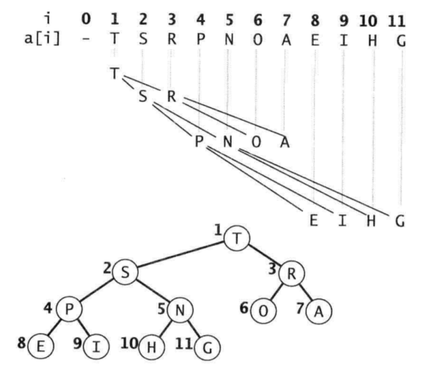

## 10.5 二叉堆

### 二叉堆
二叉堆是一组完全二叉树排序的元素，并在数组中按照层级存储（不使用数组中的第一个位置）。最大堆中，父节点的值大于等于子节点的值。
在数组实现中，位置k的结点的父节点的位置为k/2，而它的两个子节点的位置分别为2k和2k+1。这样就可以通过计算数组索引的方式在树中上下移动：从records[k]向上一层就令k等于k/2，向下一层就令k等于2k或者2k+1。具体结构可以参考下图：



接下来我们看一下二叉堆常用算法：

#### 由下到上的堆有序化（上浮）
如果堆的有序状态是因为某个节点比它的父节点大而被破坏，那么我们就交换它和它的父节点来修复堆。将这个节点不断向上移动直到遇到一个更大的父节点或者到达堆顶（堆顶位置为1）。
```Java
private void swim(int[] records, int k) {
    while (k > 1 && records[k / 2] < records[k]) {
        swap(records, k / 2, k);
        k /= 2;
    }
}
```

#### 由上到下的对有序化（下沉）
如果堆的有序状态是因为某个节点比它的子节点小而被破坏，那么我们就交换它和它的子节点中较大者来修复堆。将这个节点不断向下移动直到遇到更小的子节点或者到达堆底。
```Java
private void sink(int[] records, int k) {
    while (2 * k <= records.length) {
        int childIndex = 2 * k;
        if (childIndex < records.length && records[childIndex] < records[childIndex + 1]) {
            childIndex++;
        }
        if (records[k] < records[childIndex) {
            swap(records, k, childIndex);
        }
        k = childIndex;
    }
}
```

#### 插入元素
有了上浮算法，插入元素就很简单了。我们只需要将新元素加入到数组末尾，增加堆的大小并让新元素上浮到合适的位置即可。

#### 删除最大元素
有了下沉算法，删除最大元素也很简单。我们只需要从数组顶端删除最大元素，并将数组的最后一个元素放到顶端，减小堆的大小并让这个元素下沉到合适的位置即可。

### 堆排序
堆排序可以分为两个阶段：
1. 堆的构造阶段，我们将原始数组组织安排到一个堆中，使用下沉算法，我们只需要下沉前一半元素即可。
2. 下沉排序阶段，此时迭代进行，将最大元素删除，然后放入到堆缩小后数组空出的位置（即将最大元素和最后一个元素交换，然后下沉交换后的元素即可）。
```Java
public void heapSort(int[] records) {
    int length = records.length;
    for (int i = length / 2; i >= 1; i--) {
        sink(records, i);
    }
    while (length > 1) {
        swap(records, 1, length--);
        sink(records, 1, length);
    }
}
```