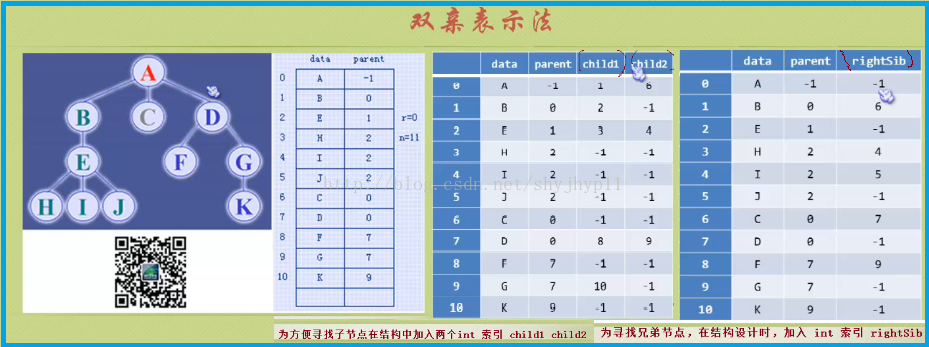
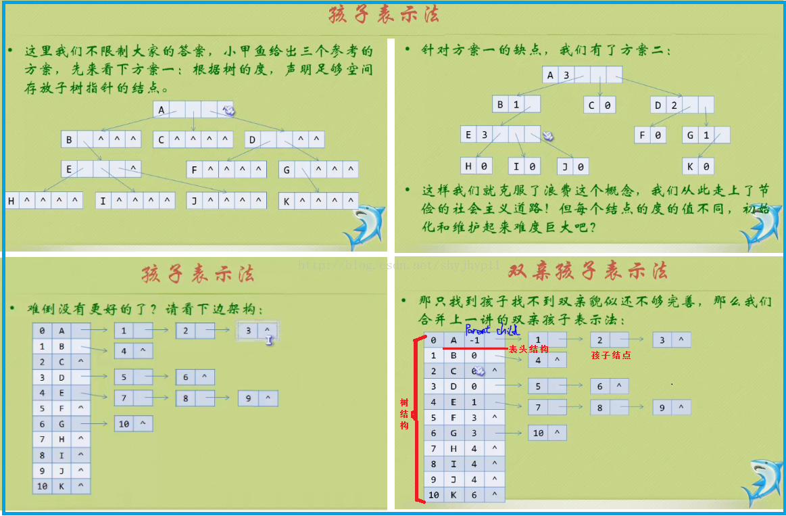

## 10.6 二叉树
首先我们定义一下二叉树节点：
```Java
class TreeNode {
    int value;
    TreeNode left;
    TreeNode right;
    
    public TreeNode(int value) {
        this.value = value;
    }
}
```

### 10.6.1 构建二叉树

#### 前序和中序来构建二叉树
同样方法适用于后序和中序求解二叉树：
1. 寻找树的根节点，即前序遍历的第一个节点（后序遍历的最后一个节点）；
2. 求解树的子树，找到根节点在中序遍历中的位置，位置左边的是左子树，位置右边的是右子树；
3. 对二叉树的左右子树分别进行上述步骤，递归进行，直到求出树结构。

这里前序（后序）主要提供根节点的位置，而中序提供左右子树结构，从而唯一确定一棵二叉树，而已知前序后序是不一定可以确定一棵二叉树。
```Java
public TreeNode buildTree(int[] preOrder, int[] inOrder) {
    return buildTree(preOrder, 0, preOrder.length, inOrder, 0, inOrder.length);
}
TreeNode buildTree(int[] preOrder, int preLeft, int preRight, int[] inOrder, int inLeft, int inRight) {
    if (preLeft == preRight) {
        return null;
    }

    if (inLeft == inRight) {
        return null;
    }

    int value = preOrder[preLeft];
    TreeNode node = new TreeNode(value);
    int index = inLeft;
    for (index = inLeft; index < inRight; index++) {
        if (value == inOrder[index]) {
            break;
        }
    }

    int leftSize = index - inLeft;
    node.left = buildTree(preOrder, preLeft + 1, preLeft + leftSize + 1, inOrder, inLeft, inLeft + leftSize);
    node.right = buildTree(preOrder, preLeft + leftSize + 2, preRight, inOrder, index + 1, inRight);
    return node;
}
```

### 10.6.2 遍历

#### 深度遍历
二叉树的深度遍历分为三种：前序遍历（根->左子->右子）；中序遍历（左子->根->右子）；后序遍历（左子->右子->根）。其递归实现比较简单，这里就不再给出详细的代码。

接下来我们看一下非递归实现，非递归实现需要使用栈，栈的关键在于先进后出。算法如下：即先把根节点入栈（这时栈中有一个元素），然后把栈顶出栈（即根节点），再把它的右左孩子入栈（注意是先进右后进左，此时栈中有两个元素），然后再把栈顶出栈（即左孩子），然后再把栈顶元素的右左孩子入栈，此过程一直执行到栈为空，出栈的元素按照顺序排列就是先序遍历。

#### 前序遍历：
根据先序遍历的顺序，先访问根节点，再访问左子树，后访问右子树，而对于每个子树来说，又按照同样的访问顺序进行遍历。非递归的实现思路如下，对于任意节点p：
1. 访问节点p，并将节点p入栈，判断结点p的左子是否为空；
2. 若p的左子不为空，则将p的左子置为当前的结点p，重复步骤1；
3. 若p的左子为空，则将栈顶结点出栈（注意此时并不访问），同时将出栈节点的右子置为当前节点，看是否为空，
4. 若不为空，则循环至步骤1；
5. 如果为空，则重复步骤3中操作，继续出栈栈顶节点，同时将出栈节点的右子职位当前节点，看其是否为空，重复步骤4和5；
6. 直到当前节点p为null并且栈为空，则遍历结束。

```Java
public void preOrder(TreeNode root) {
    Stack<TreeNode> stack = new Stack<>();
    TreeNode p = root;
    while (p != null || !stack.isEmpty()) {
        while (p!= null) {
            visit(p);
            stack.push(p);
            p = p.left;
        } 
        p = stack.pop();
        p = p.right;
    }
}
```

先序遍历还有一个更简单的写法：
```Java
public void preOrder(TreeNode root) {
    Stack<TreeNode> stack = new Stack<>();
    if (root != null) {
        stack.push(root);
    }
    while (!stack.isEmpty()) {
        TreeNode node = stack.pop();
        visit(node);
        if(node.right != null) {
            stack.push(node.right);
        }
        if(node.left != null) {
            stack.push(node.left);
        }
    }
}
```

#### 中序遍历
根据中序遍历的顺序，先访问左子树，再访问根节点，后访问右子树，而对于每个子树来说，又按照同样的访问顺序进行遍历。非递归的实现思路如下，对于任一节点p：
1. 若p的左孩子不为空，则将p入栈并将p的左孩子置为当前节点，然后再对当前节点进行相同的处理；
2. 若p的左孩子为空，则访问p节点，而后将p的右孩子置为当前节点，看其是否为空；
3. 若不为空，则步骤1和2；
4. 若为空，则执行出栈操作，输出栈顶节点，并将出栈的节点的右孩子置为当前节点，看其是否为空，重复步骤3和4；
5. 直到当前节点p为null并且栈为空，则遍历结束。

```Java
public void inOrder(TreeNode root) {
    Stack<TreeNode> stack = new Stack<>();
    TreeNode p = root;
    while (p != null || stack.size() > 0) {
        while (p!= null) {
            stack.push(p);
            p = p.left;
        } 
        p = stack.pop();
        visit(p);
        p = p.right;
    }
}
```

#### 层次遍历
层次遍历比较复杂，会有两个方向的遍历：从外层是从上到下，而内层从左到右遍历。具体代码如下所示：
```Java
public List<List<Integer>> levelOrder(TreeNode root) {
    List<List<Integer>> result = new ArrayList<>();
    Queue<TreeNode> queue = new LinkedBlockingQueue<>();
    if (root != null) {
        queue.add(root);
    }
    //从上向下遍历
    while (!queue.isEmpty()) {
        int size = queue.size();
        List<Integer> l = new ArrayList<>();
        //从左到右遍历
        for (int i = 0; i < size; i++) {
            TreeNode cur = queue.poll();
            l.add(cur.value);
            if (current.left != null) {
                queue.add(current.left);
            }
            if (current.right != null) {
                queue.add(current.right);
            }
        }
        result.add(l);
    }
}
```

二叉树的主要问题基本上都是遍历问题，接下来我们会看一下典型例子。
* 先序遍历：在第一次遍历到节点时就执行操作，一般只是想遍历执行操作（或输出结果）可选用先序遍历
* 中序遍历：对于BST，中序遍历的操作顺序是符合从小到大（或从大到小）顺序的，故要遍历输出排序好的结果需要使用中序遍历
* 后序遍历：后序遍历用途较多，其左子-右子-根的遍历特点决定了其bottom-up的返回顺序，即每次子树处理完了后在当前节点上汇总结果。可以解决很多和subtree，tree path相关的问题。

### 10.6.3 层次遍历应用

#### 反转二叉树
反转二叉树，即交换每个节点的左子节点和右子节点。与二叉树的层次遍历一样，这里需要使用队列这个辅助数据结构，具体代码如下所示：
```Java
public void reverse(TreeNode root) {
    if (root == null) {
        return;
    }
    Queue<TreeNode> nodes = new LinkedBlockingQueue<>();
    nodes.add(root);
    while (!nodes.isEmpty()) {
        TreeNode node = nodes.poll();
        swap(node.left, node.right);

        if (node.left != null) {
            nodes.add(node.left);
        }
        if (node.right != null) {
            nodes.add(node.right);
        }
    }
}
```

#### Zigzag level order
该题比较简单，相邻层反转一下即可，具体代码如下所示：
```Java
public List<List<Integer>> zigzagOrder(TreeTreeNode node) {
    Queue<TreeTreeNode> queue = new LinkedBlockingQueue<>();
    List<List<Integer>> result = new ArrayList<>();
    if (node != null) {
        queue.offer(node);
    }
    boolean isReverse = false;
    while (!queue.isEmpty()) {
        int size = queue.size();
        List<Integer> l = new ArrayList<>();
        for (int i = 0; i < size; i++) {
            TreeTreeNode cur = queue.poll();
            l.add(cur.value);

            if (cur.left != null) {
                queue.offer(cur.left);
            }
            if (cur.right != null) {
                queue.offer(cur.right);
            }
        }
        if (isReverse) {
            Collections.reverse(l);
        }
        result.add(l);
        isReverse = !isReverse;
    }
    return result;
}
```

#### right side view
该题也比较简单，每一层最后一个节点加入结果集即可。具体代码如下所示：
```Java
public List<Integer> rsv(TreeTreeNode node) {
    Queue<TreeTreeNode> queue = new LinkedBlockingQueue<>();
    List<Integer> result = new ArrayList<>();
    if (node != null) {
        queue.offer(node);
    }
    while (!queue.isEmpty()) {
        int size = queue.size();
        for (int i = 0; i < size; i++) {
            TreeTreeNode cur = queue.poll();
            if (i == size - 1) {
                result.add(cur.value);
            }

            if (cur.left != null) {
                queue.offer(cur.left);
            }
            if (cur.right != null) {
                queue.offer(cur.right);
            }
        }
    }
    return result;
}
```

#### vertical order
以root为原点，每次左走一步为offset-1，右走一步为offset+1。把所有offset相等的node放到一个list里即可。即就是bfs时记录每个node的横向offset，并且使一个Map存储offset相同的nodes。具体代码如下所示：
```Java
static class IndexTreeNode {
    int index;
    TreeTreeNode node;

    public IndexTreeNode(int index, TreeTreeNode node) {
        this.index = index;
        this.node = node;
    }
}

public List<List<Integer>> verticalOrder(TreeTreeNode node) {
    List<List<Integer>> result = new ArrayList<>();

    Map<Integer, List<Integer>> map = new TreeMap<>();
    Queue<IndexTreeNode> queue = new LinkedBlockingQueue<>();
    if (node != null) {
        queue.offer(new IndexTreeNode(0, node));
    }
    while (!queue.isEmpty()) {
        IndexTreeNode cur = queue.poll();
        int i = cur.index;
        TreeNode n = cur.node;
        List<Integer> l = map.computeIfAbsent(i, k -> new ArrayList<>());
        l.add(n.value);

        if (n.left != null) {
            queue.offer(new IndexTreeNode(i - 1, n.left));
        }
        if (n.right != null) {
            queue.offer(new IndexTreeNode(i + 1, n.right));
        }
    }

    for (Map.Entry<Integer, List<Integer>> entry : map.entrySet()) {
        result.add(entry.getValue());
    }

    return result;
}
```

#### isCompleted Tree
完全二叉树的定义：若设二叉树的高度为h，前h-1层都是满的，第h层如果有空缺，则是缺在右边，即第n层的最右边的节点，它的左边是满的，右边是空的。这个问题的描述已经提示了解法，采用层次遍历，从根节点开始，遇到第一个没有左儿子或者右儿子的节点，则设置标志位，如果之后再遇到有左/右儿子的节点，那么这不是一颗完全二叉树。
```Java
public boolean isComplete() {
    return isComplete(root);
}
private boolean isComplete(TreeNode root) {
    if (root == null) {
        return true;
    }
    Queue<TreeNode> queue = new LinkedBlockingQueue<>();
    queue.add(root);
    bool isEmpty = false;
    while (!queue.isEmpty()) {
        TreeNode node = queue.poll();
        if(node.left == null && node.right == null) {
            return true;
        }
        if (node.left == null && node.right != null) {
            return false;
        }
        if (isEmpty && (node.left != null || node.right != null)) {
            return false;
        }
        if (node.right == null) {
            isEmpty = true;
        }
        if (node.left != null) {
            queue.add(node.left);
        }
        if (node.right != null) {
            queue.add(node.right);
        }
    }
}
```

### 10.6.4 先序遍历应用

#### 求解根节点到某个节点的路径
既是寻路问题，又是查找节点问题，这里使用一个链表来存放路径：压入根节点，再从左子树中查找（递归进行的），如果未找到，再从右子树中查找，如果也未找到，则弹出根节点。如果找到，则链表中存放的节点就是路径，具体代码如下所示：
```Java
public void getTreeNodePath(TreeNode root, TreeNode node) {
    List<TreeNode> path = new ArrayList<>();
    boolean ret = getTreeNodePath(root, node, path);
    if (ret) {
        //print the path
    }
}
private boolean getTreeNodePath(TreeNode root, TreeNode node, List<TreeNode> path) {
    if (root == null) {
        return false;
    }

    path.add(root);
    if (root.value == node.value) {
        return true;
    }
    if (node.left != null) {
        return getTreeNodePath(root.left, node, path);
    }
    if (node.right != null) {
        return getTreeNodePath(root.right, node, path);
    }
    path.remove(path.size() - 1);
    
    return false;
}
```

#### 二叉树中两个节点之间的路径
与上题类似，先求出到根节点的路径，然后从这两个路径中找到最近的公共父节点，从而找出两个节点之间的路径。

#### 路径之和
给定一个值sum，找出所有从根节点到叶节点的路径，其和等于这个给定值。
```Java
public List<List<Integer>> pathSum(TreeNode root, int sum) {
    List<List<Integer>> result = new ArrayList<>();
    List<Integer> path = new ArrayList<> ();
    pathSum(root, sum, path, result);
    return result;
}
private void pathSum(TreeNode node, int sum, List<Integer> path, List<List<Integer>> result) {
    if (node == null) {
        return;
    }

    path.add(node.value);
    if (node.left == null && node.right == null) {
        if (sum == node.value) {
            result.add(new ArrayList<>(path));
        }
    }

    pathSum(node.left, sum - node.value, path, result);
    pathSum(node.right, sum - node.value, path, result);
    path.remove(path.size() - 1);
}
```

### 10.6.5 中序遍历应用
对于BST而言，中序遍历是有序的，所以一般在处理有序问题时会考虑使用中序遍历。

#### 二叉查找树转化为双向链表
我们知道BST的中序遍历是有序的，所以我们需要使用中序遍历解决这个问题，问题的关键在于如何做好拼接工作：我们需要使用一个变量prev用于保存遍历时的上一个节点，和当前节点做双向拼接，具体代码如下所示：
```Java
private TreeNode bstToList(TreeNode node) {
    Stack<TreeNode> stack = new Stack<>();
    TreeNode p = node;
    TreeNode prev = null;
    TreeNode head = null;
    while (p != null || stack.size() > 0) {
        while (p!= null) {
            stack.push(p);
            p = p.left;
        } 
        
        p = stack.pop();
        //do business
        if (prev == null) {
            head = p;
        } else {
            prev.right = p;
            p.left = prev;
        }
        prev = p;
        
        p = p.right;
    }
    return head;
}
```

#### 二叉查找树转化为有序单链表
同样，我们也可以将BST转化为单链表，只需要将上面遍历的p.left置为null即可。

####　中序遍历下一个节点
二叉树给出parent指针，找到中序遍历时当前节点的下一个节点。

对当前节点进行分情况讨论，如果右子树不为空，则一直找到右子树最左边的节点；否则一路沿着right-parent向上走直到是左子树为止，返回parent即可。
```Java
public TreeNode successor(TreeNode node) {
    if (node.right != null) {
        node = node.right;
        while (node.left != null) {
            node = node.left;
        }
        return node;
    }
    
    while (node.parent != null && node == node.parent.right) {
        node = node.parent;
    }
    return node.parent;
}
```

本题的另一个版本是：BST不给出parent指针时，求解下一个节点（>key的最小值），其等同于ceil问题，后面在BST一节我们会详细讨论，这里就不再详述了。

### 10.6.6 后序遍历应用
二叉树的问题很适合使用分治（divide&conquer）解决，因为左右子树是independent的。一般来说，divide步骤非常简单，就是recursively call on root.left and root.right，主要的逻辑都发上在conquer阶段，即子树应该返l回什么样的结果以被当前节点拿过来解决对应问题。这个过程和后序遍历很相似。

#### 高度
计算二叉树的高度，一般采用后续遍历：先计算出左子树和右子树的高度，然后取较大者加1即为二叉树的高度，递归进行即可求出：
```Java
public int height() {
    return height(root);
}
private int height(TreeNode node) {
    if (node == null) {
        return 0;
    } else {
        int leftHeight = height(node.left);
        int rightHeight = height(node.right);
        return Math.max(leftHeight, rightHeight) + 1;
    }
}
```

#### 判断二叉树是否是平衡二叉树
根据平衡二叉树的定义可知，每个节点的左右子树的高度差小于等于1，只需要在计算二叉树的高度时，同时判断左右子树的高度差即可，这里可以利用高度大于0的性质，可以将平衡的树返回正常的深度值，而不平衡的则返回-1来进行区分：
```Java
public boolean isBalanced() {
    return balancedHeight(root) >= 0;
}
private int balancedHeight(TreeNode node) {
    if (node == null) {
        return 0;
    }

    int left = balancedHeight(node.left);
    int right = balancedHeight(node.right);

    if (left < 0 || right < 0 || Math.abs(left - right) > 1) {
        return - 1;
    }

    return Math.max(left, right) + 1;
}
```

#### 二叉树最大距离
如果我们把二叉树看成一个图，父子节点之间的连线看成是双向的，则“距离”为两节点之间边的个数。计算一个二叉树的最大距离有两个情况:
* 路径经过左子树的最深节点，通过根节点，再到右子树的最深节点。
* 路径不穿过根节点，而是左子树或右子树的最大距离路径，取其大者。

只需要计算这两个情况的路径距离，并取其大者，就是该二叉树的最大距离。


具体实现如下所示：
```Java
int getMaxDistance() {
    Tuple tuple = getMaxDistance(root);
    return tuple.distance;
}
Tuple getMaxDistance(TreeNode node) {
    Tuple tuple = new Result();
    if (node == null) {
        return tuple;
    }

    Tuple left = getMaxDistance(node.left);
    Tuple right = getMaxDistance(node.right);

    tuple.depth = Math.max(left.depth, right.depth) + 1;
    tuple.distance = Math.max(Math.max(left.distance, right.distance), left.depth + right.depth + 2);
    return tuple;
}

private static class Tuple {
    int distance = 0;
    int depth = -1;
}
```

### 10.6.7 lca问题

#### lca of BST
```Java
public TreeTreeNode lcaOfBST(TreeTreeNode root, TreeTreeNode p, TreeTreeNode q) {
    if (root == null) {
        return root;
    }

    if (root.value > p.value && root.value > q.value) {
        return lcaOfBST(root.left, p, q);
    }

    if (root.value < p.value && root.value < q.value) {
        return lcaOfBST(root.right, p, q);
    }

    return root;
}

public TreeTreeNode lcaOfBST1(TreeTreeNode root, TreeTreeNode p, TreeTreeNode q) {
    while (root != null) {
        if (root.value > p.value && root.value > q.value) {
            root = root.left;
        } else if (root.value < p.value && root.value < q.value) {
            root = root.right;
        } else {
            return root;
        }
    }
    return root;
}
```

#### lca of BT
```Java
public TreeTreeNode lca(TreeTreeNode root, TreeTreeNode p, TreeTreeNode q) {
    if (root == null) {
        return root;
    }

    if (root.value == p.value) {
        return p;
    }
    if (root.value == q.value) {
        return q;
    }

    if (contains(root.left, p) && contains(root.left, q)) {
        return lca(root.left, p, q);
    }

    if (contains(root.right, p) && contains(root.right, q)) {
        return lca(root.right, p, q);
    }

    return root;
}

public boolean contains(TreeTreeNode root, TreeTreeNode node) {
    if (root == null) {
        return false;
    }

    if (root.value == node.value) {
        return true;
    }

    return contains(root.left, node) || contains(root.right, node);
}
```

#### lca of deepest nodes

### 10.6.8 递归和迭代
前面我们看到链表的问题大多数是通过迭代来解决

而二叉树大多数问题是通过递归来解决，原因在于二叉树有left、right两个指针，迭代时并不太好处理。 如果我们能判断出下次迭代是left还是right（BST），则我们可以很容易的将递归转换为迭代。或者参考preOrder、inOrder和postOrder的迭代代码，使用stack保存对应状态来模拟整个过程。

### 10.6.9 树的双亲表示法和孩子表示法
学过图论后，我们知道树还可以使用其他方式表达：双亲表示法和孩子表示法。

#### 树的双亲表示法：
树的双亲表示结构如下图所示：



 ```Java
class TreeNode {
	T data;
	int parent;
}
class Tree {
	TreeNode[] nodes;
	//根的位置索引
	int root;         
	//树中结点的总数       
	int num;                
}
```

#### 树的孩子表示法：
树的双亲表示法，可以参考图的邻接表表达方式：



```Java
class TreeNode {
    T data;
    TreeNode[] children;
}
class Tree {
    TreeNode[] nodes;
    int root;
    int num;
}
```


