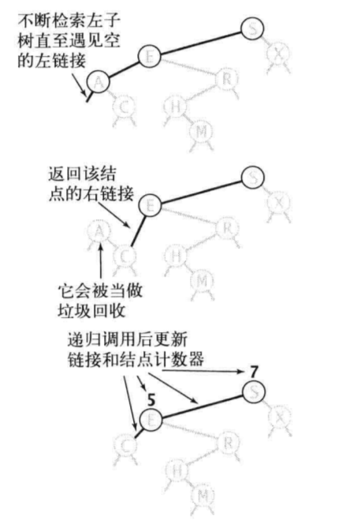
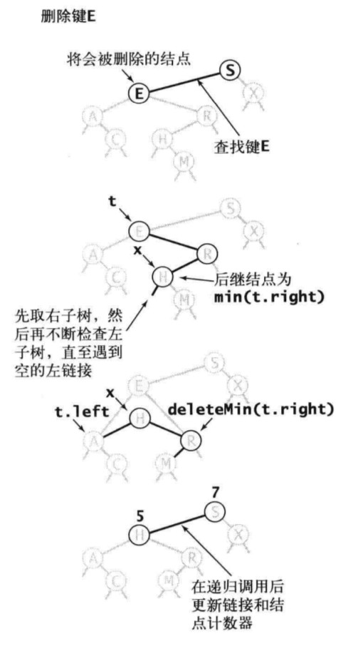

## 10.7 二叉查找树

BST本质上是一个支持动态增删改查的sorted array，所以我们在sorted array上常用的算法在BST上也同样适用，特别是二分查找。基本上BST的问题都会用到二分查找的思想，特别是要想traverse down the tree。

### 10.7.1 基本定义
二叉查找树：左子小于根，根小于右子。
```Java
public class TreeNode {
    private Integer value;
    private TreeNode left;
    private TreeNode right;
    private int size; //以该节点为根的子树中的节点总数，包括自己
    
    public TreeNode(int value, int size) {
        this.value = value;
        this.size = size;
    }
}
```

### 10.7.2 基本操作

#### insert
同查找一样，这里仍然是递归算法：
1. 如果树是空的，则返回一个含有该键值对的新节点；
2. 如果待插入的键等于根节点的键，则更新该节点的值；
3. 如果待插入的键小于根节点的键，则继续在左子树上插入该键值对，否则在右子树上插入该键值对。

```Java
public TreeNode put(TreeNode node, int value) {
    if (node == null) {
        return new TreeNode(value, 1);
    }
    if (value < node.value) {
        node.left = put(node.left, value);
    } else if (value > node.value) {
        node.right = put(node.right, value);
    }
    node.size = size(node.left) + size(node.right) + 1;
    return node;
}
```
理解查找和插入的递归实现的运行细节，可以将递归调用前的代码想象成沿着树向下走：它会将给定的键和每个节点的键相比较并根据结果向左或者向右移动到下一个节点。然后将递归调用后的代码想象成沿着树向上爬：对于get方法，这对应着一系列的返回结果；而对于put方法，这对应着重置搜索路径上每个父节点指向子节点的链接，并增加路径上每个节点上的计数器的值。

#### search
二叉查找树的查找操作很简单，就是二分查找。这里就不再详述了。

#### delete
二叉查找树中最难实现的方法就是delete方法，删除主要处理三个问题：
* 找到目标节点；
* 然后修正目标节点的链接关系（其父节点指向它的链接，它的左右子节点链接）；
* 最后删除目标节点（由于Java垃圾回收机制，这一步可以省略）。

具体又可以分为两种情况：该节点有一个子节点或者两个子节点，前者比较简单，直接将其删除，然后将其子节点链接挂在其父节点上即可。而后者比较麻烦，删除之后要处理左右两棵子树，而其父节点只有一个空出来的链接。

我们首先看只有一个子节点的情况：deleteMin方法，和put方法一样，递归方法接受一个指向节点的链接，并返回一个指向节点的链接，这样我们可以方便地改变树的结构，将返回的链接赋给作为参数的链接。对于deleteMin方法，我们要不断深入根节点的左子树中直至遇到一个空的左链接，然后将指向该节点的链接指向该节点的右子树（只需要在递归调用中返回它的右链接即可）。如下图所示：



```Java
public TreeNode deleteMin(TreeNode root) {
    if (root.left == null) {
        return root.right;
    }
    root.left = deleteMin(root.left);
    root.size = size(root.left) + size(root.right) + 1;
    return node;
}
```

然后我们看一下目标节点有两个子节点的情况，其解决方法是在删除节点node后用它的后继节点填补它的位置，可以从其右子节点树中选择最小节点替换，以保证树的有序性。具体步骤如下所示：
1. 通过比较键值找到目标节点；
2. 修正其父节点指向其的链接，这个通过递归解决；
3. 修正目标节点的两个子节点的链接问题，使用右子树的最小节点代替当前节点，然后删除右子树的最小节点。



```Java
private TreeNode delete(TreeNode root, int value) {
    if (node == null) {
        return null;
    }
    if (value < root.value) {
        node.left = delete(node.left, value);
    } else if (value > root.value) {
        node.right = delete(node.right, value);
    } else {
        if (node.right == null) {
            return node.left;
        }
        if (node.left == null) {
            return node.right;
        }
        TreeNode tmp = node;
        node = min(node.right);
        node.left = tmp.left;
        node.right = deleteMin(node.right);
    }
    node.size = size(node.left) + size(node.right) + 1;
    return node;
}
```

### 10.7.3 顺序操作

#### find min和max
find Min：核心思路就是一路向左，走到最左边的节点。
find Max：核心思路就是一路向右，走到最右边的节点。
```Java
public TreeNode min(TreeNode root) {
    if (root.left == null) {
        return root;
    }
    return min(root.left);
}
```

#### find floor和ceil
find floor(value)：查找BST中所有<=value的最大值；find ceil(value)：查找BST中所有>=value的最小值。

这里以floor为例简单说明一下查找过程，首先和root比较：如果value=root.value，则floor即为root.value；如果`value<root.value`，则说明floor值在左子树上，则递归左子树查询即可；如果`value>root.value`，则说明floor值可能在右子树上，此时如果右子树上能找到floor值，则返回，否则返回roo.value。具体代码如下所示：
```Java
public TreeNode floor(TreeNode root, int value) {
    if (root == null) {
        return null;
    }

    if (root.value == value) {
        return root;
    } else if (root.value > value) {
        return floor(root.left, value);
    } else {
        TreeNode right = floor(root.right, value);
        return right == null ? root : right;
    }
}
```
接下来我们给出一个迭代版本
```Java
public TreeNode floor(TreeNode root, int k) {
    TreeNode ret = null;
    
    while (root != null) {
        if (root.value > k) {
            root = root.left;
        } else {
            ret = root;
            root = root.right;
        }
    }
    return ret;
}
```

#### select
我们想找到排名为k的键（树中有k个小于它的键），如果左子树的节点数size大于k，那么我们继续（递归）在左子树中查找排名为k的键；如果size等于k，我们就返回根节点中的键；如果size小于k，我们就继续（递归）地在右子树查找排名为（k-size-1）的键。
```Java
public TreeNode select(TreeNode root, int k) {
    if (root == null) {
        return null;
    }

    int leftSize = size(root.left);
    if (leftSize > k) {
        return select(root.left, k);
    } else if (leftSize == k) {
        return root;
    } else {
        return select(root.right, k - leftSize - 1);
    }
}
```

#### rank
rank是select的逆方法，它会返回给定键的排名。它的实现和select类似：如果给定的键和根节点的键相等，则返回左子树中的节点总数size；如果给定的键小于根节点的键，则返回该键在左子树上的排名（递归计算）；如果给定的键大于根节点，我们会返回size+1（根节点）加上它在右子树上的排名（递归计算）。
```Java
private int rank(TreeNode root, int value) {
    if (root == null) {
        return 0;
    }
    int leftSize = size(root.left);
    if (value < root.value) {
        return rank(root.left, value);
    } else if (value > root.value) {
        return rank(root.right, value) + leftSize + 1;
    } else {
        return leftSize;
    }
}
```

#### find range
该问题比较简单，直接将[k1, k2]的值找到就行。需要将结果有序输出，则使用中序遍历即可。具体代码如下所示：
```Java
public List<Integer> range(int k1, int k2) {
    List<Integer> result = new ArrayList<>();
    range(root, k1, k2, result);
    return result;
}

public void range(TreeNode node, int k1, int k2, List<Integer> result) {
    if (node == null) {
        return;
    }
    
    //剪枝
    if (node.left != null && node.value > k1) {
        range(node.left, k1, k2, result);
    }

    if (k1 <= node.value && node.value <= k2) {
        result.add(node.value);
    }
    
    //剪枝
    if (node.right != null && node.value < k2) {
        range(node.right, k1, k2, result);
    }
}
```

#### 总结
BST里面，任意位置都可以通过value的比较确定相对位置，这是 BST 一个最好用的性质。

当操作需要修正BST的结构时（比如插入删除），递归方法接受一个指向节点的引用，并返回一个指向节点的引用，并将返回的结果赋值给当前参数。