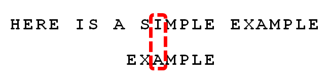

## 10.8 字符串

### 10.8.1 字符串排序

#### 键索引计数法
前面我们说过基于比较的排序的下限是NlogN，而键索引计数法是线性的，它不需要比较，非常适合小整数键。该方法一共有四个步骤：
1. 频率统计：使用一个int数组count[]计算每一个键出现的频率，对于数组中的每个元素，都使用它的键访问count[]中的相应元素并将其加1，即键为r，则将count[r+1]加1（这里之所以是r+1，是为了第二步方便将频率转化为索引）；
2. 将频率转化为索引：然后使用count[]来计算每个键在排序结果中的起始索引位置，一般而言，任意给定的键的起始索引均为所有较小的键所对应的频率之和。即对于每个键值r，其起始索引为小于r+1的键的频率之和，也就是为小于r的键的频率之和加上count[r]，因此很容易从左到右将count[]转化为一张用于排序的索引表。
3. 数据分类：将count[]转换为一张索引表后，将所有元素复制到一个辅助数组aux[]中进行排序，每个元素在aux[]中的位置由它的键对应的count[]值决定，在移动之后将count[]中对应元素的值加1，以保证count[r]总是下一个键为r的元素在aux[]中的索引位置。
4. 回写：在将元素移动到辅助数组aux[]的过程中完成了排序，所以最后一步只需要将排序结果复制回原数组。

```Java
public static class Record {
    String name;
    int key;
}
public void indexSort(Record[] records) {
    int length = records.length;
    Record[] aux = new Record[length];
    int base = 256;
    int[] count = new int[base + 1];

    for (Record record: records) {
        count[record.key + 1]++;
    }

    for (int i = 0; i < base; i++) {
        count[i + 1] += count[i];
    }

    for (Record record: records) {
        aux[count[record.key]++] = record;
    }

    System.arraycopy(aux, 0, records, 0, length);
}
```

#### 低位优先的字符串排序
该算法适合于定长字符串，具体算法比较简单：如果字符串的长度为width，那就从右到左以每个位置的字符为键，用键索引计数法将字符串排序width遍。
```Java
public lsdSort(String[] records, int width) {
    int len = records.length;
    int base = 256;
    String[] aux = new String[len];
    for (int d = width - 1; d >= 0; d--) {
        int count = new int[base + 1];
        for (int i = 0; i < base; i++) {
            count[i + 1] ++ count[i];    
        }
        for (String record: records) {
            aux[count[record.charAt(d)++]] = record;
        }
        System.arraycopy(aux, 0, records, 0, length);
    }
}
```

#### 高位优先的字符串排序
要实现一个通用的字符串排序算法（字符串的长度不一定相等），就应该考虑从左到右遍历所有字符（递归），首先使用键索引计数法将所有字符串按照首字母排序，然后再将每个首字母所对应的子数组排序，递归进行。
```Java
public void msdSort(String[] records) {
    msdSort(records, 0, records.length - 1, 0);
}
private void msdSort(String[] records, int low, int high, int d) {
    int base = 256;
    int[] count = new int[base + 2];
    String[] aux = new String[records.length];
    for (int i = low; i < high; i++) {
        count[charAt(records[i], d) + 2]++;
    }

    for (int i = 0; i < base + 1; i+=) {
        count[i + 1] += count[i];
    }

    for (int i = low; i < high; i++) {
        aux[count[charAt(records[i], d)]++] = records[i];
    }

    System.arraycopy(aux, 0, records, low, high + 1 - low);
    for(int r = 0; r < base; r++) {
        msdSort(records, low + count[r], low + count[r + 1] - 1; d + 1);
    }
}
private int charAt(String s, int d) {
    if(d < s.length()) {
        return s.charAt(d);
    }
    return -1;
}
```

#### 三向字符串排序

### 10.8.2 子串查找

#### KMP算法
在说KMP算法之前，我们先约定两个定义：如果对某个字符串y有x=ωy，则称字符串ω是x的前缀，记为w<x；如果对某个字符串y有x=yω，则称字符串ω是x的后缀，记为w>x。

现在我们简单看一下KMP算法，假设现在文本串S匹配到i位置，模式串P匹配到j位置：
1. 如果j=-1，或者当前字符匹配成功（即S[i] == P[j]），则令i++，j++，继续匹配下一个字符；
2. 如果j!=-1，且当前字符匹配失败（即S[i] != P[j]），则令i不变，j=next[j]。此举意味着失配时，模式串P相对于文本串S向右移动了j-next[j]位。即当匹配失败时，模式串向右移动的位数为：失配字符所在位置 - 失配字符对应的next值。

这里简单介绍一下next数组的含义：当前字符之前的字符串中，最长相同前缀后缀的长度。例如如果next[j]=k，代表j之前的字符串中有最大长度为k的相同前缀后缀。

这里举个例子简单分析一下：


当S[10]跟P[6]匹配失败时，KMP不是跟暴力匹配那样简单的把模式串右移一位，而是令i不变，j=next[j]，即j从6变到2（后面我们将求得P[6]，即字符D对应的next值为2），所以相当于模式串向右移动的位数为j-next[j]=6-2=4，如下图所示：


向右移动4位后，S[10]跟P[2]继续匹配：移动4位后，模式串中又有个“AB”可以继续跟S[8]S[9]匹配，从而不用让i回溯。相当于在除去字符D的模式串子串中寻找相同的前缀和后缀，然后根据前缀后缀求出next数组，最后基于next数组进行匹配。

##### 求解next数组
接下来我们看next数组怎么求解，一般可以采用递推的方法计算next数组，下面直接看代码：
```Java
private int[] makeNext(String pat) {
    int len = pat.length();
    int[] next = new int[len];
    for (int i = 1; i < len; i++) {
        int k = next[i - 1];
        while (k > 0 && pat.charAt(i) != pat.charAt(k)) {
            //这个是整个算法的精髓所在
            k = next[k - 1];
        }
        if (pat.charAt(i) == pat.charAt(k)) {
            k++;
        }
        next[i] = k;
    }
    return next;
}
```
这里简单讲解一下：
1. 已知前一步计算的pattern.substring(0, i-1)这个子串的相同前缀后缀长度为k（k>0）；
2. 然后比较第i项pattern.charAt(i)和pattern.charAt(k)；
3. 如果两者相等，则直接k++，即可得到pattern.substring(0, i)这个子串的相同前缀后缀；
4. 如果不相等，则利用已经得到的next[0...k-1]来求解pattern.substring(0, i)这个子串的最大的相同前缀后缀，即k = next[k - 1]；

下面我们将详细解释一下这个算法，如下图所示：


首先我们假设第j位及其之前的next数组都已经求出了，则可知
next[j]=k；
next[k]=绿色索引（图中的色块代表数组中的一位，与宽度没有关系）；
next[绿色索引]=黄色索引

然后我们看一下下图，可以得到更多的信息：


由上图我们可以得到如下结论：
* 由next[j]=k这个条件，我们可以得到A1子串=A2子串，同样由next[k]=绿色索引这个条件，我们可以得到B1子串=B2子串，由next[绿色索引]=黄色索引这个条件，我们可以得到C1子串=C2子串；
* 由A1=A2可以得知B2=B3，即B1=B3（这个很关键）；
* 同理可得C1=C4。

接下来我们就用上面的这些结论来求解当第j+1位失配时的next[j+1]：
我们已知A1=A2，那么现在就需要判断A1和A2分别往后增加一个字符后是否还相等：
* 如果pattern[k]==pattern[j]，则next[j+1]就直接等于k+1。
* 如果pattern[k]!=pattern[j]，那么就只能从已知的，除了A1和A2之外，最长的B1和B3这个相同前后缀来进行求解了，即k=next[k-1]，
* 现在的问题就变成了B1和B3分别往后增加一个字符后是否还相等呢，递归进行即可求出next[j+1]。

最后我们给出KMP的代码：
```Java
public List<Integer> kmp(String txt, String pat) {
    List<Integer> ps = new ArrayList<>();
    int[] next = makeNext(pat);

    int j = 0;
    for (int i = 0; i < txt.length(); i++) {
        while (j > 0 && txt.charAt(i) != pat.charAt(j)) {
            j = next[j - 1];
        }

        if (txt.charAt(i) == pat.charAt(j)) {
            j++;
        }

        if (j == pat.length()) {
            ps.add(i - j + 1);
            //匹配位置是否可以重叠，不能重叠则j = 0
            j = next[j - 1];
        }
    }
    return ps;
}
```

##### 总结
KMP算法的关键是当前位置不匹配时，在之前的已匹配文本子串中寻找最长的suffix，其和已匹配模式子串的prefix相同（即已匹配模式子串的相同前缀后缀），由于这一部分相等，所以可以将模式串一次性向后移这个长度。

#### BM算法
BM算法比KMP算法更为巧妙，也更快。这里我们给出算法思想，不再讨论具体的实现，如下图所示：


首先，txt与pattern头部对齐，从尾部开始比较。这是一个很聪明的想法，因为如果尾部字符不匹配，那么只要一次比较，就可以知道前7个字符（整体上）肯定不是要找的结果。我们看到，txt中的S与patten中的E不匹配。这时，S就被称为坏字符，即不匹配的字符。我们还发现，S不包含在模式串EXAMPLE之中，这意味着可以把搜索词直接移到S的后一位。


仍然是从尾部开始比较，发现txt中的P与pattern中的E不匹配，所以P是坏字符。但是，P包含在模式串EXAMPLE之中。所以，将模式串后移两位，两个P对齐。


我们由此总结出坏字符规则：后移位数 = 坏字符的位置 - 模式串中的上一次出现位置，如果坏字符不包含在模式串之中，则上一次出现位置为-1。以P为例，它作为坏字符，出现在第6位（从0开始编号），在模式串中的上一次出现位置为4，所以后移6-4=2位。再以前面第二步的S为例，它出现在第6位，上一次出现位置是 -1（即未出现），则整个搜索词后移6-(-1)=7位。


仍然是从尾部开始比较，txt中的E与pattern中的E匹配。


比较前面一位，txt中的LE与pattern中的LE匹配。


比较前面一位，txt中的MPLE与pattern中的MPLE匹配。我们把这种情况称为好后缀，即所有尾部匹配的字符串。注意，MPLE、PLE、LE、E都是好后缀。



比较前一位，发现txt中的I与pattern中的A不匹配。所以，I是坏字符。


根据坏字符规则，此时搜索词应该后移2-(-1)=3位。问题是，此时有没有更好的移法？


此时可以采用好后缀规则（参考KMP的公共前缀后缀）：后移位数 = 好后缀的位置 - 搜索词中的上一次出现位置；
举例来说，如果字符串ABCDAB的后一个AB是好后缀。那么它的位置是5（从0开始计算，取最后的B的值），在搜索词中的上一次出现位置是1（第一个B的位置），所以后移5-1=4位，即将前一个AB移到后一个AB的位置。再举一个例子，如果字符串ABCDEF的EF是好后缀，则EF的位置是5，上一次出现的位置是-1（即未出现），所以后移5-(-1)=6位，即整个字符串移到F的后一位。

这个规则有三个注意点：
* 好后缀的位置以最后一个字符为准。假定ABCDEF的EF是好后缀，则它的位置以F为准，即5（从0开始计算）。
* 如果好后缀在搜索词中只出现一次，则它的上一次出现位置为-1。比如，EF在ABCDEF之中只出现一次，则它的上一次出现位置为-1（即未出现）。
* 如果好后缀有多个，则除了最长的那个好后缀，其他好后缀的上一次出现位置必须在头部。比如，假定BABCDAB的好后缀是DAB、AB、B，请问这时好后缀的上一次出现位置是什么？回答是，此时采用的好后缀是B，它的上一次出现位置是头部，即第0位。这个规则也可以这样表达：如果最长的那个好后缀只出现一次，则可以把搜索词改写成如下形式进行位置计算(DA)BABCDAB，即虚拟加入最前面的DA。

回到上文的这个例子。此时，所有的好后缀（MPLE、PLE、LE、E）之中，只有E在EXAMPLE还出现在头部，所以后移6-0=6位。


可以看到，坏字符规则只能移3位，好后缀规则可以移6位。所以，BM算法的基本思想是，每次后移这两个规则之中的较大值。更巧妙的是，这两个规则的移动位数，只与搜索词有关，与原字符串无关。因此，可以预先计算生成《坏字符规则表》和《好后缀规则表》，使用时只要查表比较一下就可以了。

#### RK算法
RK算法比较巧妙：将模式串pattern的hash值跟文本串txt中的每一个等长子串的hash值比较。如果不同，则它们肯定不相等；如果相同详细比较每一位。

现在问题的关键就是对于所有位置i，高效计算文本串中i+1位置的子串的hash值。这可以由一个简单的数学公式得到，这里使用$ t_\i $表示txt.charAt(i)，那么文本txt中起始于位置i的子串所对应的hash值即为：
```
t_{i} : txt.charAt(i)
x_i = t_i * R^{M-1} + t_{i+1} * R^{M-2} +...+ t_{i+M-1} * R^0$
```
假设已知$ h(x_i)= x_i mod Q $。将模式串右移一位即等价于将$ x_i $替换为：
$$ x_{i+1} = (x_i - t_i * R^{M - 1}) * R + t_{i+M}$
即将它减去第一个数字的值，乘以R，再加上最后一个数字的值。这样我们就可以使用txt中起始位置i的子串的hash值来计算起始位置i+1的子串的hash值。

具体代码如下所示：
```Java
public class RK {
    private String pattern;
    private long patternHash;
    private long mPrime = 997;
    private int BASE = 256;
    private long RM;

    public RK(String pattern) {
        pattern = pattern;
        RM = 1;
        for (int i = 1; i < pattern.length(); i++) {
            RM = (BASE * RM) % mPrime;
        }
        patternHash = hash(pattern);
    }

    private long hash(String txt) {
        return hash(txt, txt.length());
    }

    private long hash(String txt, int len) {
        long hash = 0;
        for (int i = 0; i < len; i++) {
            hash = (BASE * hash + txt.charAt(i)) % mPrime;
        }
        return hash;
    }

    public boolean check(int i) {
        return true;
    }

    public int search(String txt) {
        int patternLen = pattern.length();
        int txtLen = txt.length();
        long txtHash = hash(txt, patternLen);
        if (patternHash == txtHash && check(0)) {
            return 0;
        }

        for (int i = patternLen; i < txtLen; i++) {
            txtHash = (txtHash + mPrime - RM * txt.charAt(i - patternLen) % mPrime) % mPrime;
            txtHash = (txtHash * BASE + txt.charAt(i)) % mPrime;
            if (patternHash == txtHash && check(i - patternLen + 1)) {
                return i - patternLen + 1;
            }
        }
        return txtLen;
    }
}
```

#### 通配符匹配
实现一个通配符模式匹配，其中“?”可以匹配任何单个字符，而“\*”可以匹配任何子串。例如文本串“aab”和模式串“a\*b”是匹配的。该算法的关键是“\*”可以匹配任何子串，所以遇到“\*”时，使用模式串“\*”后面的子串去逐一匹配文本串对应位置的子串。例如“aabcd”和“a\*cd
”匹配，而“aabcd”和“a\*c”不匹配。具体代码如下所是：
```Java
public boolean isMatch(String txt, String pat) {
    return isMatch(txt, 0, pat, 0);
}
public boolean isMatch(String txt, int i, String pat, int j) {
    if (i == txt.length() && j == pat.length()) {
        return true;
    }
    if (i == txt.length() || j == pat.length()) {
        return false;
    }

    if (pat.charAt(j) == '*') {
        //跳过连续的*号，需要注意的是j最少+1
        while (j < pat.length() && pat.charAt(j) == '*') {
            j++;
        }
        //模式串的最后一个字符是*时，肯定匹配
        if (j == pat.length()) {
            return true;
        }
        //尝试后面的子串匹配
        while (i < txt.length() && !isMatch(txt, i, pat, j)) {
            i++;
        }
        //如果到文本串的末尾，说明后面的子串不匹配
        return i < txt.length();
    } else {
        if (matchFirst(txt, i, pat, j)) {
            return isMatch(txt, ++i, pat, ++j);
        } else {
            return false;
        }
    }
}
public boolean matchFirst(String txt, int i, String pat, int j) {
    if (i == txt.length() && j == pat.length()) {
        return true;
    }
    if (i == txt.length() || j == pat.length()) {
        return false;
    }
    return txt.charAt(i) == pat.charAt(j) || pat.charAt(j) == '?';
}
```

#### 正则表达式匹配
实现一个正则表达式匹配，其中“？”可以匹配任何单个字符，而“\*”可以0到n个前导字符。例如文本串“aab”和模式串“c\*a\*b”是匹配的。该算法的关键是如何处理模式串中的“\*”号，当下一个字符是“\*”号时，首先尝试代表0个前导字符匹配，然后逐渐尝试多个的情况（此时需要首先判断首字符是否匹配）。
```Java
public boolean isMatch(String txt, String pat) {
    return isMatch(txt, 0, pat, 0);
}
public boolean isMatch(String txt, int i, String pat, int j) {
    if (i == txt.length() && j == pat.length()) {
        return true;
    }
    if (i == txt.length() || j == pat.length()) {
        return false;
    }

    //判断是否到模式串的末尾，或者下一个字符不是"*"号
    if (j == pat.length() - 1 || pat.charAt(j + 1) != '*') {
        if (matchFirst(txt, i, pat, j)) {
            return isMatch(txt, ++i, pat, ++j);
        }
        return false;
    } else {
        //尝试“*”号代表0个前导字符的情况
        if (isMatch(txt, i, pat, j + 2)) {
            return true;
        }
        //如果首字符匹配，则尝试“*”号代表多个前导字符的情况
        while (matchFirst(txt, i, pat, j)) {
            if (isMatch(txt, ++i, pat, j + 2)) {
                return true;
            }
        }
        return false;
    }
}
public boolean matchFirst(String txt, int i, String pat, int j) {
    if (i == txt.length() && j == pat.length()) {
        return true;
    }
    if (i == txt.length() || j == pat.length()) {
        return false;
    }
    return txt.charAt(i) == pat.charAt(j) || pat.charAt(j) == '?';
}
```

### 10.8.3 Trie树
和各种查找树一样，Trie是由链接的节点所组成的数据结构，每个节点有R条链接，其中R为字母表的大小（单词查找树一般含有大量的空链接，图中把空连接忽略掉了）。需要注意的是，虽然图中每个节点都有一个字符，但是每一个节点并没有显示存储字符，而是根据链接是否为空来间接表示。每个节点除了存储R个链接之外，还存有一个相应的值，可以是空也可以是符号表中的某个键所关联的值。我们将每个键所关联的值都存储在该键的最后一个字母所对应的节点中。


#### 节点的表示
如下图所示：Trie有如下两个重要的性质：
1. 每个节点都含有R个链接，对应着每个可能出现的字符
2. 字符和键都隐式地保存在数据结构中


可以对比一下Trie树和多叉树节点数据结构：
```Java
class Node<V> {
    V value;
    Node<V>[] next = new Node[BASE];
}

class Node<K, V> {
    K key;
    V value;
    Node<K, V>[] next = new Node[BASE];
}
```
我们发现：Trie树Node结构中没有Key，这就是Trie树不同于一般多叉树的地方，其Key是由root到该节点的所有边的字符串接而成，如果该节点value不为空，则说明存在该（k，v）数据；否则说明不存在该（k，v）数据。

#### 查找
在Tries中查找可能会出现三种情况：
1. 键的尾字符所对应的节点中的值非空，如下图中shells的查找，这是一次命中的查找：键所对应的值就是键的尾字符所对应的节点中所保存的值；
2. 键的尾字符所对应的节点中的值为空，如下图中shell的查找，这是一次失败的查找：符号表中不存在该键；
3. 查找结束于一条空链接，这也是一次失败的查找。


#### 插入
和二叉查找树一样，在插入之前进行一次查找，此时可能会出现两种情况：
1. 在到达键的尾字符之前就遇到了一个空链接，在这种情况下，就需要为键中还未被检查的每个字符创建一个节点，并将键的值保存在最后一个字符的节点中；
2. 在遇到空链接之前就到达了尾字符，在这种情况下，就将该节点的值设为键所对应的值。

#### 删除
从Trie树中删除一个键值对的第一步是：
* 找到该键所对应的节点并将它的value设为null；
* 如果该节点不是叶子节点，则删除操作完成；否则需要从Trie树中删除该节点，并以此类推到其父节点。

#### 查找所有键
前面说过，在Trie树中，键不是显式地表示在每一个节点上，而是隐式地表示在路径上。所以查找所有键时，使用一个字符串来保存从根节点出发的路径上的一系列字符。

#### 代码实现
```Java
public class Trie<V> {
    private static int BASE = 256;
    private Node<V> root;

    private static class Node<V> {
        V value;
        Node<V>[] next = new Node[BASE];
    }

    public int size() {
        return size(root);
    }

    private int size(Node node) {
        if (node == null) {
            return 0;
        }

        int size = 0;

        if (node.value != null) {
            size++;
        }
        for (char c = 'a'; c <= 'z'; c++) {
            size += size(node.next[c]);
        }

        return size;
    }

    public V get(String key) {
        Node<V> node = get(root, key, 0);
        if (node == null) {
            return null;
        }
        return node.value;
    }

    private Node<V> get(Node<V> node, String key, int d) {
        if (node == null) {
            return null;
        }
        if (d == key.length()) {
            return node;
        }
        char c = key.charAt(d);
        return get(node.next[c], key, d + 1);
    }

    public void put(String key, V value) {
        root = put(root, key, value, 0);
    }

    private Node<V> put(Node<V> node, String key, V value, int d) {
        if (node == null) {
            node = new Node<>();
        }
        if (d == key.length()) {
            node.value = value;
            return node;
        }
        char c = key.charAt(d);
        node.next[c] = put(node.next[c], key, value, d + 1);
        return node;
    }

    public void delete(String key) {
        root = delete(root, key, 0);
    }

    private Node<V> delete(Node<V> node, String key, int d) {
        if (node == null) {
            return null;
        }

        if (d == key.length()) {
            //目标节点，value置为null
            node.value = null;
        } else {
            //递归找到目标节点
            char c = key.charAt(d);
            node.next[c] = delete(node.next[c], key, d + 1);
        }

        //节点的value不为null，则说明当前节点应该保留
        if (node.value != null) {
            return node;
        }
        //节点的子链接不为null，则说明当前节点应该保留
        for (char c = 'a'; c <= 'z'; c++) {
            if (node.next[c] != null) {
                return node;
            }
        }
        //否则当前节点应该删除
        return null;
    }

    public List<String> keys() {
        return keysWithPrefix("");
    }

    public List<String> keysWithPrefix(String pre) {
        List<String> keys = new ArrayList<>();
        //先找到pre对应的TrieNode
        Node<V> node = get(root, pre, 0);
        //然后搜集该node的所有子节点
        collect(node, pre, keys);
        return keys;
    }

    private void collect(Node<V> node, String pre, List<String> keys) {
        if (node == null) {
            return;
        }

        if (node.value != null) {
            keys.add(pre);
        }
        for (char c = 'a'; c <= 'z'; c++) {
            collect(node.next[c], pre + c, keys);
        }
    }

    public List<String> keysMatch(String pat) {
        List<String> keys = new ArrayList<>();
        collect(root, "", pat, keys);
        return keys;
    }

    private void collect(Node<V> node, String pre, String pat, List<String> keys) {
        if (node == null) {
            return;
        }

        int d = pre.length();
        if (d == pat.length() && node.value != null) {
            keys.add(pre);
        }
        if (d == pat.length()) {
            return;
        }

        char next = pat.charAt(d);
        for (char c = 'a'; c <= 'z'; c++) {
            if (next == '.' || next == c) {
                collect(node.next[c], pre + c, pat, keys);
            }
        }
    }

    public String longestPrefixOf(String txt) {
        int length = search(root, txt, 0, 0);
        return txt.substring(0, length);
    }

    private int search(Node<V> node, String txt, int d, int length) {
        if (node == null) {
            return length;
        }

        if (node.value != null) {
            length = d;
        }

        if (d == txt.length()) {
            return length;
        }

        char c = txt.charAt(d);
        return search(node.next[c], txt, d + 1, length);
    }
}
```

#### Trie应用
Trie主要有以下几种应用场景：
* 单词查询：查询一个单词是否在Trie树中，get(key)查询即可。
* 前缀查询：查询某个单词的前缀是否出现过，对于单词key，对其所有prefix，调用get(prefix)查询即可。
* 词频统计：统计出现频率最高的n个单词，分治+Trie+最小堆，value为频率即可。
* 单词补全：即查询以某个prefix开始的keyset，调用keysWithPrefix(pre)方法即可。

#### 总结
Trie树最直观的定义就是LinkedList of HashMap。所以Trie和HashMap都可以用来查询某个单词是否在字典当中，我们需要知道他们的优缺点。
* 优点：支持字符级别的查询（比如上面提到的单词补全）。比如说我们需要在matrix当中通过traverse构造单词，那么这个单词是一个一个字符形成的，我们可以在traverse的每一步去检验当前路径是否可以形成valid word。另外，对于含有regex符号的字符串，我们需要一个字符一个字符的考虑，这种情况下我们也需要通过trie去查找。其次Trie节省空间，相同的prefix只存一遍，而HashMap需要存很多遍。
* 缺点：实现起来较麻烦，除非需要支持字符级别的查询，否则应该使用HashMap。

### 10.8.4 后缀树
后缀树就是将一个字符串的所有后缀建立的Trie树，其编程模型较后缀数组复杂，一般实现时都使用后缀数组，这里就不再详述后缀树。

### 10.8.5 后缀数组
后缀数组：给定字符串s（长度为n），将其n个后缀从小到大排序之后，即为后缀数组，其是后缀树的简化版本，解决字符串问题中非常有用，我们看一下后缀数组中的相关概念：
* 后缀数组sa[]：保存了一个字符串的所有后缀，并且按字典序排序。sa[i]=k的意思就是排在第i个的后缀，在原串里是以位置k开始的后缀。
* 名次数组rank[]：是sa数组的逆运算，rank[i]=k的意思是从位置i开始的后缀在后缀数组中排第k位。可知其与sa[]为逆运算：sa[rank[i]]=i。
* height[]：后缀数组中相邻两个后缀的最大公共前缀，height[i]的值是sa[i-1]和sa[i]的公共前缀长度。


我们首先看一下如何求解后缀数组（名次数组），其中的关键如何高效排序，我们看一下倍增算法。

#### 倍增算法
首先简要阐述一下倍增算法的思想：要给后缀数组所有的后缀排序，首先排序这些后缀中长度为1的前缀，然后再排序长度为2的前缀，然后再排序长度为4的前缀...根据以上性质，在使用基数排序法时，每一次给长度k的前缀排序时都利用到了之前长度为k/2的前缀排序的结果。具体入下图所示：


```Java
public class SuffixArray {
    private static final int BASE = 255;

    private String txt;
    private int[] sa;
    private int[] height;

    public SuffixArray(String txt) {
        this.txt = txt;
        sa = calSA(txt);
        height = calHeight();
    }

    public int[] getSa() {
        return sa;
    }

    public int[] getHeight() {
        return height;
    }

    private int[] calSA(String txt) {
        if (txt == null || txt.length() == 0) {
            return null;
        }

        int len = txt.length();

        //初始化rank数组：第一次排序根据后缀的第一个字符
        int[] rank = new int[len];
        for (int i = 0; i < len; i++) {
            rank[i] = txt.charAt(i);
        }

        Tuple[] tuples = new Tuple[len];
        for (int k = 1; k <= len; k <<= 1) {
            int offset = k >> 1;
            for (int i = 0; i < len; i++) {
                //构造排序关键字：第一关键字是rank后的前H/2，第二关键字是rank后的后H/2
                int first = rank[i];
                int j = i + offset;
                int second = (j < len) ? rank[j] : 0;
                tuples[i] = new Tuple(i, first, second);
            }
            rank = calRank(tuples);
        }

        //求解sa数组：rank是从1开始的
        int[] sa = new int[rank.length];
        for (int i = 0; i < rank.length; i++) {
            sa[rank[i] - 1] = i + 1;
        }
        return sa;
    }

    private int[] calRank(Tuple[] tuples) {
        //排序tuples
        radixSort(tuples);

        int len = tuples.length;
        int[] rank = new int[len];
        //根据排序后的tuples计算rank数组，rank从1开始
        int r = 1;
        rank[tuples[0].suffix] = r;
        for (int i = 1; i < len; i++) {
            //第一关键字和第二关键字有一个不相等，则rank++
            if (!tuples[i].equals(tuples[i - 1])) {
                r++;
            }
            rank[tuples[i].suffix] = r;
        }

        return rank;
    }

    private void radixSort(Tuple[] tuples) {
        countSort(tuples, false);
        countSort(tuples, true);
    }

    private void countSort(Tuple[] tuples, boolean isFirst) {
        for (Tuple tuple : tuples) {
            tuple.isFirst = isFirst;
        }

        int[] count = new int[BASE + 1];
        Arrays.fill(count, 0);

        Tuple[] aux = new Tuple[tuples.length];
        for (Tuple tuple : tuples) {
            count[tuple.key() + 1]++;
        }

        for (int i = 0; i < BASE; i++) {
            count[i + 1] += count[i];
        }

        for (Tuple tuple : tuples) {
            aux[count[tuple.key()]++] = tuple;
        }

        System.arraycopy(aux, 0, tuples, 0, tuples.length);
    }

    private int[] calHeight();

    public int getLrs();

    static class Tuple {
        int suffix;
        int first;
        int second;
        boolean isFirst;

        public Tuple(int suffix, int first, int second) {
            this.suffix = suffix;
            this.first = first;
            this.second = second;
        }

        @Override
        public boolean equals(Object obj) {
            if (!(obj instanceof Tuple)) {
                return false;
            }
            Tuple other = (Tuple) obj;
            return first == other.first && second == other.second;
        }

        public int key() {
            if (isFirst) {
                return first;
            }
            return second;
        }
    }
}
```

#### 最长公共前缀
有了后缀数组，求解height[]就比较简单了：


具体代码如下所示：
```Java
private int[] calHeight() {
    int len = sa.length;
    int[] height = new int[len];
    for (int i = 0; i < len - 1; i++) {
        height[i + 1] = getLcp(sa[i] - 1, sa[i + 1] - 1);
    }
    return height;
}

private int getLcp(int i, int j) {
    int lcs = 0;
    int len = txt.length();
    while (i < len && j < len && txt.charAt(i) == txt.charAt(j)) {
        lcs++;
        i++;
        j++;
    }
    return lcs;
}
```
之后任意两个字串的最长公共前缀就很容易求解了，即Lcp(x,y)=min(height[x+1], ..., height[y])，这里就不再详述了。

#### 最长重复子串
给定一个字符串S，计算：
* S的最长子串，满足它在S中至少出现了两次；
* S的最长子串，满足它在S中出现至少两次，且不会相重叠。

对于第一种，利用上一节的后缀数组就能很容易求出来。依据height[]数组的定义，最大的height值即可，这里就不再详述。

针对第二种情况：可以使用二分法枚举答案，将问题转变为判定性问题：判断是否存在两个长度为mid的重复不重叠子串。统计height数组中不小于mid的最小sa和最大sa（sa代表的是原字符串中的位置），如果这两者之间的差不小于mid，则说明不重叠，即存在长度为mid的不重叠重复子串。具体代码如下所是：
```Java
public int getLrs() {
    int len = txt.length();
    int left = 1;
    int right = len;

    int ret = -1;
    while (left <= right) {
        int mid = (left + right) / 2;
        int min = sa[0];
        int max = sa[0];
        for (int i = 1; i < len; i++) {
            //height数组是相邻两个后缀的最大公共前缀，如果height小于mid，则说明需要重置max和min
            if (height[i] < mid) {
                max = sa[i];
                min = sa[i];
            } else {
                min = Math.min(min, sa[i]);
                max = Math.max(max, sa[i]);
                //sa代表的是txt中对应的位置，如果两者之差大于mid，则说明不重叠
                if (max - min >= mid) {
                    ret = mid;
                    break;
                }
            }
        }

        if (ret == mid) {
            left = mid + 1;
        } else {
            right = mid - 1;
        }
    }
    return ret;
}    
```

#### 最长公共子串
给定两个字符串s和t，求它们的最长公共子串。这个问题有两种解法：动态规划和后缀数组。后面我们会详细分析动态规划问题，这里我们就只看后缀数组的解法。

将s和t连接成一个字符串。中间使用一个特殊字符隔开，求出新串的的后缀数组。如果两个相邻后缀分别属于s和t，那么它们的最长公共前缀就是一个公共子串，在所有公共字串中取最大值即可。具体代码如下所是：
```Java
public int getLcs(String s, String t) {
    String txt = s + "#" + t;
    SuffixArray suffixArray = new SuffixArray(txt);
    int[] sa = suffixArray.getSa();

    int[] height = suffixArray.getHeight();
    int ret = 0;
    int si = 0;
    int ti = 0;
    //sa[0]一定是"#"+t，则height[1]一定是0（不可能有和'#'匹配）
    for (int i = 2; i < txt.length(); i++) {
        //height[i]是sa[i-1]和sa[i]的最大公共前缀，而sa代表的是位置，则要求这两个一个大于s.length一个小于s.length
        if ((sa[i] < s.length()) != (sa[i - 1] < s.length())) {
            if (height[i] > ret) {
                ret = height[i];
                //si是这两个较小值，ti是这两个较大值
                si = Math.min(sa[i], sa[i - 1]);
                ti = Math.max(sa[i], sa[i - 1]);
            }
        }
    }
    return ret;
}
```

#### 最长回文子串
给定一个字符串s，求出其最长的回文子串。这个问题同样有两种解法：动态规划和后缀数组。

这个问题和上一个问题相似，将s反转后，得到字符串t，则问题变为求解字符串s和t的最长公共子串。这里就不再给出详细的代码。
