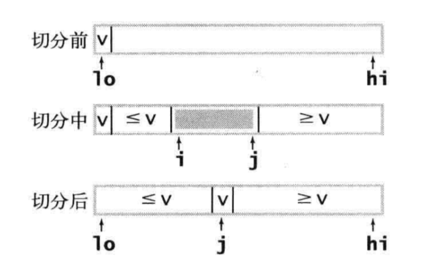
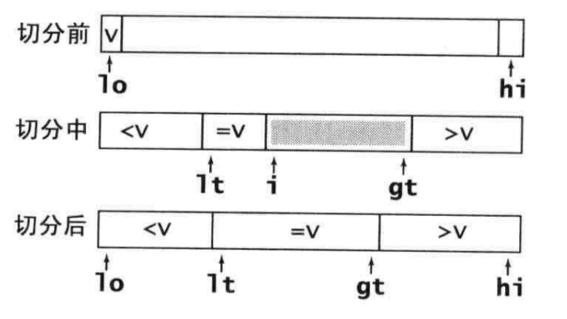

## 10.9 排序

### 10.9.1 初级排序算法
#### 选择排序
首先找到数组中最小的那个元素，将它和数组中的第一个元素交换位置（如果第一个元素就是最小元素那么它就和自己交换），然后在剩下的元素中找到最小的元素，将它和数组中的第二个元素交换位置。如此反复，直到将整个数组排序（之所以叫做选择排序，是因为它不断地在选择剩余元素中的最小者）。

```Java
public void selectionSort(int[] nums) {
    for (int i = 0; i < nums.length; i++) {
        int minIndex = i;
        for (int j = i + 1; j < nums.length; j++) {
            if (nums[minIndex] > nums[j]) {
                minIndex = j;
            }
        }
        swap(nums, minIndex, i);
    }
}
```

#### 插入排序
参考人们整理桥牌的方法：一张一张的来，将每一张牌插入到其他已经有序的牌中的适当位置。在计算机实现中，为了给要插入的元素腾出空间，我们需要将其余所有元素在插入之前都向右移动一位。

```Java
public void insertionSort(int[] nums) {
    for (int i = 1; i < nums.length; i++) {
        for (int j = i; j >= 1 && nums[j] < nums[j - 1]; j--) {
            swap(nums, j, j - 1);    
        }
    }
}
```

#### 希尔排序
希尔排序的思想是使数组中任意间隔为h的元素都是有序的，一个h有序数组即为h个相互独立的有序数组编织在一起组成的一个数组。

```Java
public void shellSort(int[] nums) {
    int h = nums.length / 3;
    while (h >= 1) {
        for (int i = h; i < nums.length; i += h) {
            for (int j = i; j >= h && nums[j] < nums[j -h]; j -= h) {
                swap(nums, j, j - h);
            }
        }
        h /= 3;
    }
}
```
### 10.9.2 归并排序

#### 归并算法
该算法比较简单，首先将所有元素复制到一个辅助数组中，然后再归并回原数组，在归并时进行4个条件判断：左半边用尽（取右半边元素）、右半边用尽（取左半边元素）、右半边当前元素小于左半边当前元素（取右半边元素）以及右半边当前元素大于等于左半边当前元素（取左半边元素）：
```Java
public void merge(int[] nums, int left, int right) {
    int[] aux = new int[right - left + 1];
    System.arraycopy(nums, left, aux, left, right - left + 1);

    int middle = (left + right) / 2;
    int leftIndex = left;
    int rightIndex = middle + 1;
    for (int i = left; i < right; i++) {
        if (leftIndex > middle) {
            nums[i] = aux[rightIndex++];
        } else if (rightIndex > right) {
            nums[i] = aux[leftIndex++];
        } else if (aux[rightIndex] < aux[leftIndex]) {
            nums[i] = aux[rightIndex++];
        } else if (aux[leftIndex] < aux[rightIndex]) {
            nums[i] = aux[leftIndex++];
        }
    }
}
```

#### 归并排序
有了归并算法之后，归并排序就很简单了，递归地将两个子数组排序，然后归并两个子数组从而将整个数组排序。
```Java
public void mergeSort(int[] nums) {
    mergeSort(nums, 0, nums.length - 1);
}
private void mergeSort(int[] nums, int left, int right) {
    if (left > right) {
        return;
    }

    int middle = (left + right) / 2;
    mergeSort(nums, left, middle);
    mergeSort(nums, middle + 1, right);
    merge(nums, left, middle, right);
}
```

### 10.9.3 快速排序

#### 双向切分
快速排序是一种分治的排序算法：首先将一个数组切分成两个子数组，然后将两部分独立地排序。

切分算法：首先选取一个切分元素pivot，然后从数组的左端开始向右扫描直到找到一个大于等于它的元素，再从数组的右端开始向左扫描知道找到一个小于等于它的元素，显然这两个元素是未排序的，因此交换它们的位置。如此继续，我们就可以保证左侧元素都不大于切分元素，右侧元素都不小于切分元素。当两个指针相遇时，我们只需要将切分元素pivot和左子数组最右侧的元素交换然后返回该位置即可。其大致过程如下图所示：



```Java
public void quickSort(int[] nums) {
    quickSort(nums, 0, nums.length - 1);
}
private void quickSort(int[] nums, int left, int right) {
    if (left >= right) {
        return;
    }
    int index = partition(nums, left, right);
    quickSort(nums, left, index - 1);
    quickSort(nums, index + 1, right);
}
private int partition(int[] nums, int start, int end) {
    int pivot = nums[start];
    int left = start;
    int right = end;
    while (left <= right) {
        while (left <= right && nums[left] < pivot) {
            left++;
        }
        while (left <= right && nums[right] > pivot) {
            right--;
        }
        if (left < right) {
            swap(nums, left, right);
        }
    }
    swap(nums, start, right);
    return right;
}
```
需要注意其与归并排序的区别：归并排序是将数组分成两个子数组分别排序，并将有序的子数组归并从而将整个数组排序；而快速排序是当两个子数组都有序时整个数组也就有序了。

#### 三向切分
从左到右遍历数组一次，维护一个指针lt使得nums[left...lt-1]种的元素都小于pivot，一个指针gt使得nums[gt+1...right]种的元素都大于pivot，nums[i...gt]中的元素都还未确定。一开始i和left相等，对于nums[index]进行三向比较：
1. nums[index]小于pivot，将nums[lt]和nums[index]交换，将lt和i加一；
2. nums[index]大于pivot，将nums[gt]和nums[index]交换，将gt减一；
3. nums[index]等于pivot，将i加一。
这些操作都会保证数组元素不变且缩小gt-i的值（这样循环才会结束）。另外除非和切分元素相等，其他元素都会被交换的。



```Java
public void quick3Sort(int[] nums) {
    quick3Sort(nums, 0, nums.length - 1);
}
public void quick3Sort(int[] nums, int left, int right) {
    if (right <= left) {
        return;
    }
    int pivot = nums[left];
    int lt = left;
    int gt = right;
    int index = left + 1;
    while (index <= gt) {
        if (nums[index] < pivot) {
            swap(nums, lt++, index++);
        } else if (nums[index] > pivot) {
            swap(nums, index, gt--);
        } else if (nums[index] == pivot) {
            index++;
        }
    }
    quick3Sort(nums, left, lt - 1);
    quick3Sort(nums, gt + 1, right);
}
```

### 10.9.4 计数排序
```Java
public void countSort(int[] nums) {

}
```

