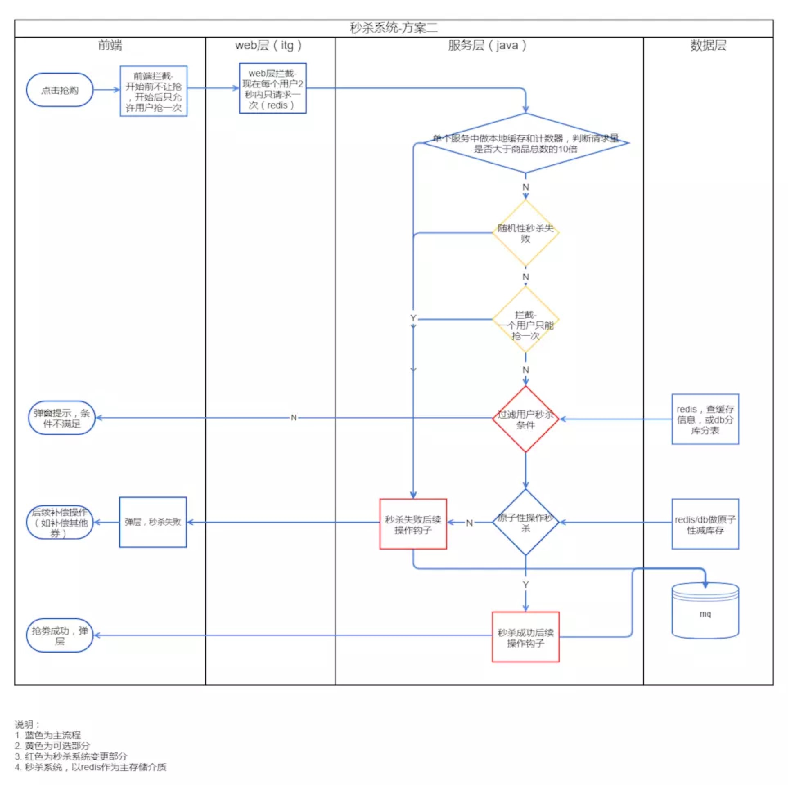

## 8.10 秒杀系统

### 前言
首先，我们看一下秒杀系统的特点：
* 秒杀时大量用户会在同一时间进行抢购，网站瞬时访问流量激增
* 秒杀一般是访问请求数量远远大于库存数量，只有少部分用户能够秒杀成功
* 秒杀业务流程比较简单，一般就是下订单减库存
* 不能超卖，高并发下的数据的强一致性

### 系统设计

#### 秒杀架构设计理念
* 限流：只有少量用户能够秒杀成功，所以要限制大部分流量，只允许少数流量进入服务后端
* 削峰：对于秒杀系统瞬时会有大量用户涌入，所以在抢购一开始会有很高的瞬间峰值。高峰值流量是压垮系统很重要的原因，所以如何把瞬间的高流量变成一段时间平稳的流量也是设计秒杀系统很重要的思路，实现削峰的常用的方法有利用缓存和消息中间件等技术。
* 异步处理：秒杀系统是一个高并发系统，采用异步处理模式可以极大地提高系统并发量，其实异步处理就是削峰的一种实现方式。
* 内存缓存：秒杀系统最大的瓶颈一般都是数据库读写，由于数据库读写属于磁盘IO，性能很低，如果能够把部分数据或业务逻辑转移到内存缓存，效率会有极大地提升。

#### 架构方案

##### 设计思路
* 将请求拦截在系统上游，降低下游压力：秒杀系统特点是并发量极大，但实际秒杀成功的请求数量却很少，所以如果不在前端拦截很可能造成数据库读写锁冲突，甚至导致死锁，最终请求超时。
* 充分利用缓存：利用缓存可极大提高系统读写速度。
* 消息队列：消息队列可以削峰，将拦截大量并发请求，这也是一个异步处理过程，后台业务根据自己的处理能力，从消息队列中主动的拉取请求消息进行业务处理。

##### 前端
页面静态化：将活动页面上的所有可以静态的元素全部静态化，并尽量减少动态元素，通过CDN来抗峰值
禁止重复提交：用户提交之后按钮置灰，禁止重复提交
用户限流：在某一时间段内只允许用户提交一次请求，比如可以采取IP限流

##### 后端
1. 网关层
限制uid（UserID）访问频率：我们上面拦截了浏览器访问的请求，但针对某些恶意攻击或其它插件，在服务端控制层需要针对同一个访问uid，限制访问频率。

2. 服务层
上面只拦截了一部分访问请求，当秒杀的用户量很大时，即使每个用户只有一个请求，到服务层的请求数量还是很大。

如果要求不能超卖，不能使用Redis进行减库存操作。
秒杀系统的关键问题是如何正确的减库存，由于并发量非常大，这里尽量不要使用关系数据库来处理该操作，可以使用Redis来处理该操作。

利用缓存应对读请求：对类似于12306等购票业务，是典型的读多写少业务，大部分请求是查询请求，所以可以利用Redis分担数据库压力。
利用缓存应对写请求：缓存也是可以应对写请求的，比如我们就可以把数据库中的库存数据转移到Redis缓存中，所有减库存操作都在Redis中进行，然后再通过后台进程把Redis中的用户秒杀请求同步到数据库中。

为了提升整体的处理能力，可采用读写分离方式。所有的读操作通过从库完成，所有的写操作写入主库。

当用户秒杀成功后，进入之后的业务流程：支付下单，这里就不再详述。

### 实现案例
#### 活动描述
现有商品A(sku_id=001)、B(sku_id=002)、C(sku_id=003)，要求 2018.12.15 当天的 10:30-11:00 开放秒杀数量： A(1000 件)、B(2000 件)、C（3000 件） 与 14:30-15:00 开放秒杀数量：A(1000 件)、B
(2000 件)、C（3000 件），

每次秒杀活动持续 30 分钟，每人限购：A(1 件)、B(2 件)、C(3 件)

#### 刷入商品信息
首先将秒杀商品相关信息刷入到Redis中，具体步骤如下所示：
* 刷入sku秒杀数量的数据到Redis的List数据结构中，刷入 sku_id 为 1 的商品 A 到 ms1544841000_1544842800:sku1 和 ms1544841000_1544842800:sku_copy1（备份） 中（B、C 
商品类似），其中1544841000_1544842800 表示活动开始的 unix 时间戳（精确到秒）和活动结束的 unix 时间戳（精确到秒）
* 设置列表的过期时间，使用 Redis 的 expireat 命令来指定 11:00 的 unix 时间戳（精确到秒）为过期时间，仅需要设置 key 为 ms1544841000_1544842800:sku1  即可，另一个 key 为 
ms1544841000_1544842800:sku_copy1 仅用于记录

第三步，刷入历史活动信息列表到 Redis 的 key 为 act_hmap_20181215 的 hashmap 数据结构

注意，act_hmap_20181215 这个 key 是以天为单位的。

key:1_1544841000_1544842800 value:{"sku_id":1,"start":1544841000,"end":1544842800,"total":1000,"limit":1,"rest":1000} #其中 rest 表示剩余数量，用于提供给 API 接口，以及其它 sku 信息字段，不过我建议使用指定的 sku Redis key 来保存

#### 活动进行中

1. 秒杀资格过滤

最好是让有秒杀资格的人来参与秒杀，存入到 Redis 缓存中，没有资格的人连秒杀的商品界面都不要展示出来，

为了避免机器刷单的情况，考虑加入 WAF （web 防火墙）和 单用户 Id 调用频率的控制问题，如指定用户 ID 出现异常行为，应该立刻把此用户 ID 禁用掉，或者展示图形验证码+短信验证码的形式，通过验证就可以再次秒杀。

* 避免重复下单

应该使用使用 act:1_1544841000_1544842800:user_12 这种形式的 Redis Key 来判断是否重复下单，Redis 的 setnx 可以帮你忙，

第三步，不要使用 MySQL

下单过程中，切记不可使用 MySQL，高并发的主要瓶颈之一

第四步，异步化订单处理

支付之后，系统需要生成秒杀订单数据（业务逻辑最重的环节），并调用第三方支付接口，这时可以先把信息放到 Redis 的 List 数据结构中，鉴于单机，所以这里不建议使用 Rabbit MQ，

因为它过重了，然后以恒定的速度向 MySQL 持久化订单信息以及同步 Redis 里面的秒杀订单数据，在此期间展示的秒杀订单状态是“支付结果处理中”，处理成功后，则在秒杀订单列表页展示对应的订单信息。

第五步，超量检测

由于使用了 Redis 的 List 数据结构，为了保证秒杀的成功率，秒杀成功则从里面 lpop 出指定数量的数据，应该只给用户的未支付秒杀订单 20 秒的倒计时支付时间，如超过 20 秒未支付，则无法再次从本次活动中秒杀，并把没有秒杀成功的 sku 回收到该 List 
中且最好把待回收（已锁定）数量也展示出来，因为使用了 List 数据结构，所以就算 lpop 到最后也不会出现超量的情况。

#### 活动结束后

这个就与并发没有什么关系了，主要是统计一下数据与核对订单信息什么的
