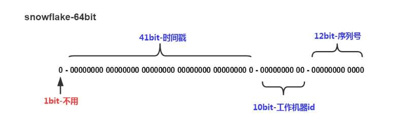

## 8.2 ID生成器

如何设计一个分布式ID生成器(Distributed	ID	Generator)，并保证ID按时间粗略有序？

### 应用场景
现实中很多业务都有生成唯一ID的需求，例如:
用户ID
微博ID
聊天消息ID
帖子ID
订单ID

### 需求

这个ID往往会作为数据库主键，所以需要保证全局唯一。数据库会在这个字段上建立聚集索引，即该字段会影响各条数据在物理存储上的顺序。

ID还要尽可能短，节省内存，让数据库索引效率更高，基本上64位整数能够满足绝大多数的场景，一般需要根据具体业务进行分析，预估出ID的最大值，从而确定位数。

查询的时候，往往有分页或者排序的需求，所以需要给每条数据添加一个时间字段，并在其上建立普通索引。但是普通索引的访问效率比聚集索引慢，如果能够让ID按照时间粗略有序，则可以省去这个时间字段。为什么不是按照时间精确有序呢？因为按照时间精确有序是做不到的，除非用一个单机算法，在分布式场景下做到精确有序性能一般很差。

这就引出了ID生成的三大核心需求:
* 全局唯一
* 按照时间粗略有序
* 尽可能短

### 实现
下面介绍一些常用的生成ID的方法。

#### UUID
UUID是一类算法的统称，具体有不同的实现。UUID的优点是每台机器可以独立产生ID，理论上保证不会重复，所以天然是分布式的。缺点是生成的ID太长，而且无序，占用内存较高，而且索引查询效率低。

用过MongoDB的人会知道，MongoDB会自动给每一条数据赋予一个唯一的ObjectId，保证不会重复，这是怎么做到的呢？实际上它用的是一种UUID算法，生成的ObjectId占12个字节，由以下几个部分组成，4个字节表示的Unix	timestamp，3个字节表示的机器的ID，2个字节表示的进程ID，3个字节表示的计数器。

#### MySQL服务器
既然MySQL可以产生自增ID，那么用多台MySQL服务器，能否组成一个高性能的分布式发号器呢？显然可以。

假设3台MySQL服务器协同工作，每个库设置的起始数字不一样，步长一样，一般是Master的个数。比如：
```
Master1生成的是1，4，7，10...
Master2生成的是2，5，8，11...
Master3生成的是3，6，9，12...
```
前面用一个round-robin	load balance负责负载均衡，每来一个请求，由round-robin balance将请求分发给3台MySQL中的任意一个，然后返回一个ID。

不过要注意，在MySQL中，不需要把所有ID都存下来，每台机器只需要存一个MAX_ID就可以了。这需要用到MySQL的一个REPLACE INTO特性。

这个方法跟单台数据库比，缺点是ID是不是严格递增的，只是粗略递增的。不过这个问题不大，我们的目标是粗略有序，不需要严格递增。

### snowflake算法
snowflake是Twitter开源的分布式ID生成算法，结果是一个long型的ID。其核心思想是：使用41bit的毫秒数，10bit的机器ID（5个bit是数据中心，5个bit的机器ID），12bit作为毫秒内的流水号（意味着每个节点在每毫秒可以产生4096个ID），最后还有一个符号位，永远是0。如下图所示：



这里我们给出了实现代码：
```Java
public class SnowFlake {
    private final static long START_TIMESTAMP = 1480166465631L;

    private final static long SEQUENCE_BIT = 12;
    private final static long MACHINE_BIT = 5;
    private final static long IDC_BIT = 5;

    private final static long MAX_IDC_NUM = -1L ^ (-1L << IDC_BIT);
    private final static long MAX_MACHINE_NUM = -1L ^ (-1L << MACHINE_BIT);
    private final static long MAX_SEQUENCE = -1L ^ (-1L << SEQUENCE_BIT);

    private final static long MACHINE_LEFT = SEQUENCE_BIT;
    private final static long IDC_LEFT = SEQUENCE_BIT + MACHINE_BIT;
    private final static long TIMESTAMP_LEFT = IDC_LEFT + IDC_BIT;

    private long idc;  //数据中心
    private long machineId;     //机器标识
    private long sequence = 0L; //序列号
    private long lastTimestamp = -1L;//上一次时间戳

    public SnowFlake(long idc, long machineId) {
        if (idc > MAX_IDC_NUM || idc < 0) {
            throw new IllegalArgumentException("idc > MAX_IDC_NUM or < 0");
        }
        if (machineId > MAX_MACHINE_NUM || machineId < 0) {
            throw new IllegalArgumentException("machineId > MAX_MACHINE_NUM or < 0");
        }
        this.idc = idc;
        this.machineId = machineId;
    }

    public synchronized long nextId() {
        long timestamp = getNewTimestamp();
        if (timestamp < lastTimestamp) {
            throw new RuntimeException("Clock moved backwards.  Refusing to generate id");
        }

        if (timestamp == lastTimestamp) {
            //相同毫秒内，序列号自增
            sequence = (sequence + 1) & MAX_SEQUENCE;
            //同一毫秒的序列数已经达到最大
            if (sequence == 0L) {
                timestamp = getNextMill();
            }
        } else {
            //不同毫秒内，序列号置为0
            sequence = 0L;
        }

        lastTimestamp = timestamp;

        return (timestamp - START_TIMESTAMP) << TIMESTAMP_LEFT //时间戳部分
            | idc << IDC_LEFT       //数据中心部分
            | machineId << MACHINE_LEFT             //机器标识部分
            | sequence;                             //序列号部分
    }

    private long getNextMill() {
        long mill = getNewTimestamp();
        while (mill <= lastTimestamp) {
            mill = getNewTimestamp();
        }
        return mill;
    }

    private long getNewTimestamp() {
        return System.currentTimeMillis();
    }
}
```

snowflake算法可以根据自身项目的需要进行一定的修改。比如估算未来的数据中心个数，每个数据中心的机器数以及统一毫秒可以能的并发数来调整在算法中所需要的bit数。

该方案的缺点是：依赖机器时间，如果发生回拨会导致可能生成id重复。针对这个问题可以采用更换机器Id的方式来避开，如zk选一次主后递增epoch。
