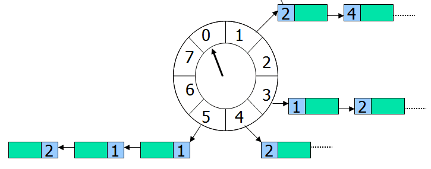

## 8.4 定时任务调度器

实现一个定时任务调度器：有很多任务，每个任务都有一个时间戳，任务会在该时间点开始执行。

方案1：PriorityBlockingQueue	+ Polling
我们很快可以想到第一个办法:使用PriorityBlockingQueue + ReentrantLock	，用一把锁把这个队列保护起来,就是线程安全的啦
对于生产者：生成任务后插入队列里
对于消费者：在while(true)循环里每隔一段时间检查一下队列（polling），如果有任务，则取出来执行。
这个方案的缺点在于轮询的时间间隔不好设置：间隔太长，则任务无法及时处理；间隔太短则浪费系统资源。

方案2：PriorityBlockingQueue	+ 时间差
可以把方案1改进一下：while(true)里的逻辑变成：查看一下堆顶的元素，但并不取出来，如果该任务过期了则取出来执行；没过期，则计算一下时间差，然后sleep()该时间差
不再是sleep一个固定间隔了，消除了轮询的缺点。

这个方案有个更严重的的缺陷：假设当前堆顶的任务在10秒后执行，消费者线程peek()查看到了后，开始sleep 10秒，这时候一个新的任务插了进来，该任务在1秒后应该执行，但是由于消费者线程要睡眠10秒，则这个新任务无法及时处理。该方案的修正方法就是当新插入一个元素时唤醒当前线程重新判断即可。即DelayQueue，接下来我们看一下其实现。

### DelayQueue
```java
public class DelayQueue<E extends Delayed> extends AbstractQueue<E> implements BlockingQueue<E> {

    private final transient ReentrantLock lock = new ReentrantLock();
    private final PriorityQueue<E> q = new PriorityQueue<E>();

    private Thread leader = null;

    /**
     * Condition signalled when a newer element becomes available
     * at the head of the queue or a new thread may need to
     * become leader.
     */
    private final Condition available = lock.newCondition();

    /**
     * Inserts the specified element into this delay queue.
     */
    public boolean offer(E e) {
        final ReentrantLock lock = this.lock;
        lock.lock();
        try {
            q.offer(e);
            if (q.peek() == e) {
                leader = null;
                available.signal();
            }
            return true;
        } finally {
            lock.unlock();
        }
    }

    /**
     * Retrieves and removes the head of this queue, or returns {@code null}
     * if this queue has no elements with an expired delay.
     */
    public E poll() {
        final ReentrantLock lock = this.lock;
        lock.lock();
        try {
            E first = q.peek();
            if (first == null || first.getDelay(NANOSECONDS) > 0)
                return null;
            else
                return q.poll();
        } finally {
            lock.unlock();
        }
    }

    /**
     * Retrieves and removes the head of this queue, waiting if necessary
     * until an element with an expired delay is available on this queue.
     */
    public E take() throws InterruptedException {
        final ReentrantLock lock = this.lock;
        lock.lockInterruptibly();
        try {
            for (;;) {
                E first = q.peek();
                if (first == null)
                    available.await();
                else {
                    long delay = first.getDelay(NANOSECONDS);
                    if (delay <= 0)
                        return q.poll();
                    first = null; // don't retain ref while waiting
                    if (leader != null)
                        available.await();
                    else {
                        Thread thisThread = Thread.currentThread();
                        leader = thisThread;
                        try {
                            available.awaitNanos(delay);
                        } finally {
                            if (leader == thisThread)
                                leader = null;
                        }
                    }
                }
            }
        } finally {
            if (leader == null && q.peek() != null)
                available.signal();
            lock.unlock();
        }
    }

    /**
     * Retrieves and removes the head of this queue, waiting if necessary
     * until an element with an expired delay is available on this queue,
     * or the specified wait time expires.
     */
    public E poll(long timeout, TimeUnit unit) throws InterruptedException {
        long nanos = unit.toNanos(timeout);
        final ReentrantLock lock = this.lock;
        lock.lockInterruptibly();
        try {
            for (;;) {
                E first = q.peek();
                if (first == null) {
                    if (nanos <= 0)
                        return null;
                    else
                        nanos = available.awaitNanos(nanos);
                } else {
                    long delay = first.getDelay(NANOSECONDS);
                    if (delay <= 0)
                        return q.poll();
                    if (nanos <= 0)
                        return null;
                    first = null; // don't retain ref while waiting
                    if (nanos < delay || leader != null)
                        nanos = available.awaitNanos(nanos);
                    else {
                        Thread thisThread = Thread.currentThread();
                        leader = thisThread;
                        try {
                            long timeLeft = available.awaitNanos(delay);
                            nanos -= delay - timeLeft;
                        } finally {
                            if (leader == thisThread)
                                leader = null;
                        }
                    }
                }
            }
        } finally {
            if (leader == null && q.peek() != null)
                available.signal();
            lock.unlock();
        }
    }
    ...
}
```
这个代码中有几个要点要注意一下：
首先我们看一下offer方法：
```java
    public boolean offer(E e) {
        final ReentrantLock lock = this.lock;
        lock.lock();
        try {
            q.offer(e);
            if (q.peek() == e) {
                leader = null;
                available.signal();
            }
            return true;
        } finally {
            lock.unlock();
        }
    }
```
如果第一个元素等于刚刚插入进去的元素，说明刚才队列是空的。现在队列里有了一个任务，那么就应该唤醒在等待的消费者线程，避免了方案2的缺点。此时还需要将leader重置为null，这些消费者之间互相竞争，自然有一个会被选为leader。

接下来我们看一下take方法：
```java
    public E take() throws InterruptedException {
        final ReentrantLock lock = this.lock;
        lock.lockInterruptibly();
        try {
            for (;;) {
                E first = q.peek();
                if (first == null)
                    available.await();
                else {
                    long delay = first.getDelay(NANOSECONDS);
                    if (delay <= 0)
                        return q.poll();
                    first = null; // don't retain ref while waiting
                    if (leader != null)
                        available.await();
                    else {
                        Thread thisThread = Thread.currentThread();
                        leader = thisThread;
                        try {
                            available.awaitNanos(delay);
                        } finally {
                            if (leader == thisThread)
                                leader = null;
                        }
                    }
                }
            }
        } finally {
            if (leader == null && q.peek() != null)
                available.signal();
            lock.unlock();
        }
    }
```
需要注意的是：当first任务还没有到期时，需要先释放first：first=null。如果删除这行代码，会发生什么呢？假设现在有2个消费者线程：
1. 线程A进来获取first，然后进入else	的else，此时设置了leader为当前线程A，并让A等待一段时间
2. 此时线程B也进来获取first，进入else的阻塞操作，注意此时线程B是持有first引用的
然后线程A等待指定时间后被唤醒，获取对象成功，将该对象移除队列，此时这个对象理应被GC回收，但是它还被线程B持有着，则造成了内存泄露。

最后我们看一下leader线程的作用：DelayQueue的设计其实是一个Leader/Follower模式，leader就是指向Leader线程的。该模式可以减少不必要的等待时间。

这里假设我们有多个消费者线程使用take方法去取任务，内部先加锁，然后每个线程都去peek第一个节点。
如果leader不为空说明已经有线程在取了，设置当前线程等待
```java
    if (leader != null)
        available.await();
```
如果为空说明没有其他线程去取这个节点，设置leader并等待delay延时到期，直到poll后结束循环
```
    else {
        Thread thisThread = Thread.currentThread();
        leader = thisThread;
        try {
            available.awaitNanos(delay);
        } finally {
            if (leader == thisThread)
                leader = null;
        }
    }
```
JDK里还有一个ScheduledThreadPoolExecutor，原理跟DelayQueue类似，封装的更完善。

### HashedWheelTimer
时间轮(HashedWheelTimer)其实很简单，就是一个循环队列，如下图所示：



上图是一个长度为8的循环队列，假设该时间轮精度为秒，即每秒走一格，像手表那样，走完一圈就是8秒。每个格子指向一个任务集合，时间轮无限循环，每转到一个格子，就扫描该格子下面的所有任务，把时间到期的任务取出来执行。

举个例子，假设指针当前正指向格子0，来了一个任务需要4秒后执行，那么这个任务就会放在格子4下面，如果来了一个任务需要20秒后执行怎么办？由于这个循环队列转一圈只需要8秒，这个任务需要多转2圈，所以这个任务的位置虽然依旧在格子4（20%8=4）下面，不过需要多转2圈后才执行。因此每个任务需要有一个字段记录需圈数，每转一圈就减1，减到0则立刻取出来执行。

时间轮的优点是性能高：插入和删除的时间复杂度都是O(1)。Linux内核中以及Netty等中的定时器采用的就是这个方案。

### zookeeper时间桶

### 分布式任务调度器
如何设计一个分布式的定时任务调度器呢？可以使用Redis ZSet实现该功能。


