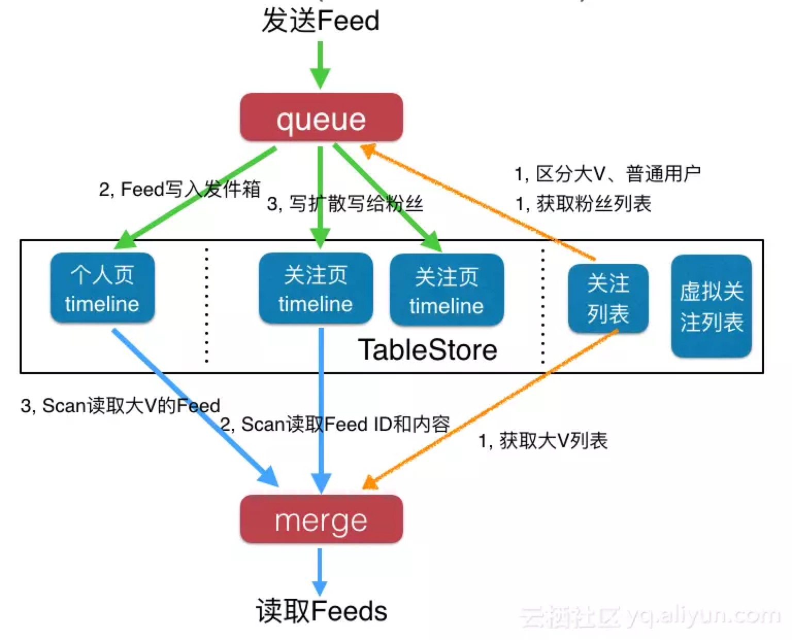

## 8.7 Feed流系统

### 前言
在移动互联网时代，Feed流产品是非常常见的，比如我们每天都会用到的朋友圈，微博，头条等。在讨论如何实现Feed流系统之前，首先我们看一下Feed流系统的特点。

#### 特征
Feed流系统有一些非常典型的特点，比如：
* 多账号内容流：Feed流系统中一般存在很多账号，账号之间可以关注，取关，加好友和拉黑等操作。只要满足这一条，那么就可以当做Feed流系统来设计。
* 非稳定的账号关系：由于存在关注，取关等操作，所以系统中的用户之间的关系就会一直在变化，是一种非稳定的状态。
* 读写比例100:1：读写严重不平衡，读多写少，一般读写比例在10：1，甚至100：1以上。

#### 分类
Feed流的分类有很多种，但最常见的分类有两种：
* Timeline：按发布的时间顺序排序，先发布的先看到，后发布的排列在最顶端。Timeline类型中，Feed流中的Feed不多，但是每个Feed都很重要，必须所有用户看到。比如微信朋友圈，微博等。
* Rank：按某个非时间的因子排序，比如用户的喜好度排序，用户最喜欢的排在最前面，次喜欢的排在后面。Rank类型中，一般Feed流中的Feed比较多，那么就为用户选择出用户最想看的Top N结果。比如知乎，头条等应用。

### 实现
设计一个Feed流系统，最关键的两个核心，一个是存储，一个是推送。

#### 存储
我们先来看存储，Feed流系统中需要存储的内容分为两部分：账号关系和Feed消息内容。存储方面一般有以下几个问题需要考虑：
* Feed流系统数据量一般比较大，如何存储大容量数据
* 数据量大了后成本就很关键，成本如何能更便宜
* 存储的可靠性：如何保证账号关系和Feed不丢失

##### 账号关系
我们先来看账号关系（比如关注列表）的存储，对于账号关系，它有一些特点：
* 是一系列的变长链表，长度可达亿级别。这样就会导致数据量比较大，但是关系极其简单。
* 还有一点是性能敏感，直接影响关注，取关的响应速度。
* 有序性：有序性并不要求具有排序功能，关注列表和粉丝列表的顺序是固定的即可，只需要能按照主键排序就行。

最适合存账号关系（关注列表）的系统应该是分布式NoSQL数据库，原因是数据量极大，关系简单不需要复杂的join，性能要求高。能满足有序性的分布式NoSQL数据库中，开源HBase就是一个，所以很多企业会选择开源HBase来存储账号关系，或者是关注列表。

##### Feed消息
接下来我们看一下Feed消息的存储，一样，我们还是先看一下Feed消息的特点：
* Feed流系统一般数据量大，而且很多Feed流系统一般选择推模式，这时候数据量会再膨胀几个数量级，所以这里的数据量很容易达到PB级别
* Feed消息数据格式简单，但是可靠性要求高
* 自增主键功能，保证个人发的Feed的消息ID在个人发件箱中都是严格递增的，这样读取时只需要一个范围读取即可。时间戳是无法保证严格递增的，这里最好是有自增功能。

根据上述这些特征，最佳的系统应该是具有主键自增功能的分布式NoSQL数据库，但是目前并没有这样的NoSQL数据库，所以常用的做法有两种：
* 关系型数据库+分库分表
* 关系型数据库+分布式NoSQL数据库：其中关系型数据库提供主键自增功能，分布式NoSQL数据库负责存储Feed消息。

除了常用的以上两个方案，还可以使用阿里云的表格存储（TableStore），我们简单看一下其特点：
* 分布式，单表可支持千万级TPS/QPS
* LSM存储引擎极大优化写，高性能实例极大优化读
* 写入成功即保证落盘成功，数据可靠性提供10个9的SLA保障
* 单表可存储十万亿行以上的数据，价格又低，轻松保存用户Feed流中的所有Feed数据

#### 推送
推送系统需要的功能有两个，一个是发布Feed，一个是读取Feed流。对于推送系统，一般有以下几个问题需要考虑：
* 如何才能提供千万的TPS和QPS
* 如何保证读写延迟在10ms，甚至2ms以下
* 如何保证Feed的必达性

首先我们来回顾下之前说的Feed流系统的特点：
* 读写严重不平衡，读多写少，一般读写比例都在10：1，甚至100：1之上
* 对Feed流产品的用户而言，读取Feed流时候的延迟敏感度要远远大于发布Feed的时候

目前推送方案，一般有两种方案，分别是：
* 拉模式：也称为读扩散，发布Feed时仅写到个人页Timeline中；读取Feed时不仅需要读取个人页Timeline，还需要读取关注页Timeline，并合并排序。
* 推模式：也成为写扩散，发布Feed时不仅需要写到个人页Timeline中，还需要写到粉丝的Timeline中；而读取时只需要读取个人页Timeline即可。

显然对于一个读远大于写的系统而言，推模式要远远比拉模式要好一些，但是也有一个副作用：数据会极大膨胀。针对这个问题，可以采用推拉结合的模式：对大V采用拉模式，普通用户使用推模式。

### 推送系统
在确定了存储方案和推送方案后，我们来总体看一下推送系统，这里我们使用阿里云的TableStore作为存储系统，这里选用推拉结合的方式（推模式更加简单）。架构图如下所示：



#### 存储
我们先来看中间黑色框中的部分，这部分是使用TableStore的数据，从左往右分别是：
* 个人页Timeline：这个是每个用户的发件箱，也就是自己的个人页页面。
* 关注页Timeline：这个是每个用户的收件箱，也就是自己的关注页页面，内容都是自己关注人发布的消息。
* 关注列表：保存账号关系，比如朋友圈中的好友关系；微博中的关注列表等。
* 虚拟关注列表：这个主要用来个性化和广告。

#### 发布Feed
当你发布一条Feed消息的时候，流程是这样的：
1. Feed消息先进入一个队列服务
2. 判断是否是大V，如果是大V，则将该Feed消息写入到个人页Timeline（发件箱），写入流程就此结束。先从关注列表中读取到自己的粉丝列表，以及判断自己是否是大V
3. 如果是普通用户，则还需要从关注列表中读取到自己的粉丝列表，然后将自己的Feed消息写给自己的粉丝的Timeline中

#### 读取Feed流
当刷新自己的Feed流的时候，流程是这样的：
1. 先去读取自己关注的大V列表
2. 去读取自己的收件箱，只需要一个GetRange读取一个范围即可，范围起始位置是上次读取到的最新Feed的ID，结束位置可以使当前时间，也可以是MAX，建议是MAX值。由于之前使用了主键自增功能，所以这里可以使用GetRange读取
3. 如果有关注的大V，则再次并发读取每一个大V的发件箱，如果关注了10个大V，那么则需要10次访问
4. 合并2和3步的结果，然后按时间排序，返回给用户

如果只使用推模式，则会更加简单：发布Feed时，不需要区分是否大V，所有用户的流程都一样，直接写入个人页和粉丝页的Timeline即可；读取Feed流时，直接去自己的Timeline页读取即可。

#### 个性化和定向广告
个性化和定向广告是两种很强烈的产品需求。个性化可以服务好用户，增大产品竞争力和用户粘性。而定向广告可以为产品增加盈利渠道。那么这两种产品该如何实现呢？在Feeds流里面这两种功能的实现方式差不多，我们以定向广告为例来说明：
1. 通过用户特征分析对用户分类，比如其中有一类是新生类：今年刚上大学的新生
2. 创建一个针对该分类的虚拟广告账号：新生广告
3. 让这些具有新生特征的用户虚拟关注新生广告账号，正常用户看不到这一层关注关系
4. 然后需要针对该账号发送广告即可

需要说明的是：每个用户可能会有多个特征，那么就可能虚拟关注多个广告账号。


### 朋友圈

### 简介
朋友圈功能总体上可以分为3部分：前端、前后端接口以及后端，这里主要以后端为主介绍一下整个系统的设计方案。

### 核心功能
* 用户层面：可以添加删除好友
* 朋友圈层面：可以发布朋友圈，拉取朋友圈，查看好友朋友圈
* 权限层面：可以设置查看权限（暂未实现）

### 数据库设计
核心结构有三张表：

####　消息表
```sql
CREATE TABLE `friend_circle_message` (
  `id` bigint(15) NOT NULL AUTO_INCREMENT COMMENT 'primary key',
  `uid` bigint(15) DEFAULT NULL COMMENT 'user id',
  `content` varchar(500) DEFAULT NULL,
  `picture` varchar(200) DEFAULT '' COMMENT 'picture',
  `location` varbinary(100) DEFAULT '' COMMENT 'location',
  `create_time` datetime DEFAULT NULL COMMENT 'create time',
  PRIMARY KEY (`id`)
)
```
消息表很好理解，存储用户发送的内容、图片以及发布时间等。 

####　时间线表
```sql
CREATE TABLE `friend_circle_timeline` (
  `id` bigint(15) NOT NULL AUTO_INCREMENT,
  `uid` bigint(15) DEFAULT NULL COMMENT 'user id',
  `fcmid` bigint(15) DEFAULT NULL COMMENT 'friend cycle message id',
  `is_own` int(1) DEFAULT '0' COMMENT 'is own',
  `create_time` datetime DEFAULT NULL COMMENT 'create time',
  PRIMARY KEY (`id`)
)
```
时间线表在朋友圈中是最关键的，存储着所有用的时间线信息，因为当用户去拉取好友圈的时候，查询的就是本表，is_own字段用来区分当前数据是自己的发布还是好友发布的消息。

####　评论表
```sql
CREATE TABLE `friend_circle_comment` (
  `id` bigint(15) NOT NULL AUTO_INCREMENT,
  `fcmid` bigint(15) DEFAULT NULL COMMENT 'friend cycle message id',
  `uid` bigint(15) DEFAULT NULL COMMENT 'user id',
  `content` varchar(500) DEFAULT NULL,
  `create_time` datetime DEFAULT NULL COMMENT 'create time',
  `like_count` int(10) DEFAULT '0' COMMENT 'like count',
  PRIMARY KEY (`id`)
) 
```
评论表，用于存储评论信息以及点赞信息，没有什么好解释的。 

### 业务逻辑
#### 发布朋友圈消息
当用户发布一条朋友圈消息的时候，后端逻辑的处理：
1. 用户A在朋友圈中发布一条消息，消息表friend_circle_message写入一条数据。
2. 时间线表friend_circle_timeline中增加一条数据，uid设置A，is_own设置为1，表示在A的时间线中增加一条自己发布的消息。
3. 查询用户A的好友，查到用户B（如果有还有其他好友D、E等等同样处理），然后在时间线表friend_circle_timeline中增加一条数据，uid设置B，is_own设置为0，表示在B的时间线中增加一条好友发布的消息。

#### 拉取朋友圈
当用户拉取朋友圈时，首先读取时间线表，拉取自己的朋友圈记录（默认朋友圈是以时间排序的，一般需要实现page功能）
```sql
SELECT * FROM friend_circle_timeline WHERE uid = ? ORDER BY create_time, id LIMIT 0, 9
```
获取到时间线记录后，再通过fcmid字段在friend_circle_message表拉取具体的消息
```sql
SELECT * FROM friend_circle_message WHERE id = ?
```

#### 添加删除好友
这里以添加好友为例简单说明一下。当用户A，添加用户B为好友之后，触发同步好友时间线的操作：
```sql
INSERT INTO friend_circle_timeline (uid,fcmid,is_own,create_time)
    SELECT #{uid},`id`,0,create_time FROM friend_circle_message WHERE uid = #{fid};
```
1. 首先把消息表friend_circle_message好友C发布的所有消息添加到自己的时间线中。
2. 再把消息表friend_circle_message自己发布的消息添加到好友C的时间线中。

注意is_own字段，因为都是互相添加好友的消息到自己的时间线中，所以都应该为false（0）。

### 总结
使用时间线表的方案，发布朋友圈消息是一个很重的操作，一方面需要在消息表插入一条消息记录，还需要将这条记录的指针插到所有好友的时间线表里，这是一个单数据副本写扩散的过程。但是相对应的，读取朋友圈就比较简单了，每一个用户只需要读取自己的时间线表，而不需要去遍历所有好友的消息表。